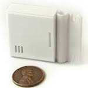

*To contribute to this page, edit the following
[file](https://github.com/Koenkk/zigbee2mqtt.io/blob/master/docgen/device_page_notes.js)*

# Nyce NCZ-3011-HA

| Model | NCZ-3011-HA  |
| Vendor  | Nyce  |
| Description | Door/window sensor |
| Supports | motion, humidity and temperature |
| Picture |  |

## Notes


### Device type specific configuration
*[How to use device type specific configuration](../configuration/device_specific_configuration.md)*


* `temperature_precision`: Controls the precision of `temperature` values,
e.g. `0`, `1` or `2`; default `2`.


* `humidity_precision`: Controls the precision of `humidity` values, e.g. `0`, `1` or `2`; default `2`.


## Manual Home Assistant configuration
Although Home Assistant integration through [MQTT discovery](../integration/home_assistant) is preferred,
manual integration is possbile with the following configuration:


### NCZ-3011-HA

```yaml
binary_sensor:
  - platform: "mqtt"
    state_topic: "zigbee2mqtt/<FRIENDLY_NAME>"
    availability_topic: "zigbee2mqtt/bridge/state"
    payload_on: true
    payload_off: false
    value_template: "{{ value_json.occupancy }}"
    device_class: "motion"

sensor:
  - platform: "mqtt"
    state_topic: "zigbee2mqtt/<FRIENDLY_NAME>"
    availability_topic: "zigbee2mqtt/bridge/state"
    unit_of_measurement: "%"
    device_class: "humidity"
    value_template: "{{ value_json.humidity }}"

sensor:
  - platform: "mqtt"
    state_topic: "zigbee2mqtt/<FRIENDLY_NAME>"
    availability_topic: "zigbee2mqtt/bridge/state"
    unit_of_measurement: "°C"
    device_class: "temperature"
    value_template: "{{ value_json.temperature }}"

sensor:
  - platform: "mqtt"
    state_topic: "zigbee2mqtt/<FRIENDLY_NAME>"
    availability_topic: "zigbee2mqtt/bridge/state"
    unit_of_measurement: "-"
    value_template: "{{ value_json.linkquality }}"
```



