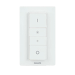

*To contribute to this page, edit the following
[file](https://github.com/Koenkk/zigbee2mqtt.io/blob/master/docgen/device_page_notes.js)*

# Device

| Model | 324131092621  |
| Vendor  | Philips  |
| Description | Hue dimmer switch |
| Supports | on/off, brightness, up/down/hold/release, click count |
| Picture |  |

## Notes


### Pairing
Factory reset the Hue dimmer switch by pressing and holding the setup button on the back for 10 seconds.

Restart the Hue dimmer switch by holding all 4 buttons of the Hue dimmer switch.
You can let go when the light on the front flashes red/green briefly.

Use the Hue dimmer switch to factory reset a Hue light bulb see
[HOWTO: Factory reset a Hue bulb](https://www.youtube.com/watch?v=qvlEAELiJKs).
After resetting the bulb will automatically connect.


## Manual Home Assistant configuration
Although Home Assistant integration through [MQTT discovery](../integration/home_assistant) is preferred,
manual integration is possbile with the following configuration:


### 324131092621

```yaml
sensor:
  - platform: "mqtt"
    state_topic: "zigbee2mqtt/<FRIENDLY_NAME>"
    availability_topic: "zigbee2mqtt/bridge/state"
    icon: "mdi:gesture-double-tap"
    value_template: "{{ value_json.action }}"

sensor:
  - platform: "mqtt"
    state_topic: "zigbee2mqtt/<FRIENDLY_NAME>"
    availability_topic: "zigbee2mqtt/bridge/state"
    unit_of_measurement: "%"
    device_class: "battery"
    value_template: "{{ value_json.battery }}"

sensor:
  - platform: "mqtt"
    state_topic: "zigbee2mqtt/<FRIENDLY_NAME>"
    availability_topic: "zigbee2mqtt/bridge/state"
    unit_of_measurement: "-"
    value_template: "{{ value_json.linkquality }}"
```



