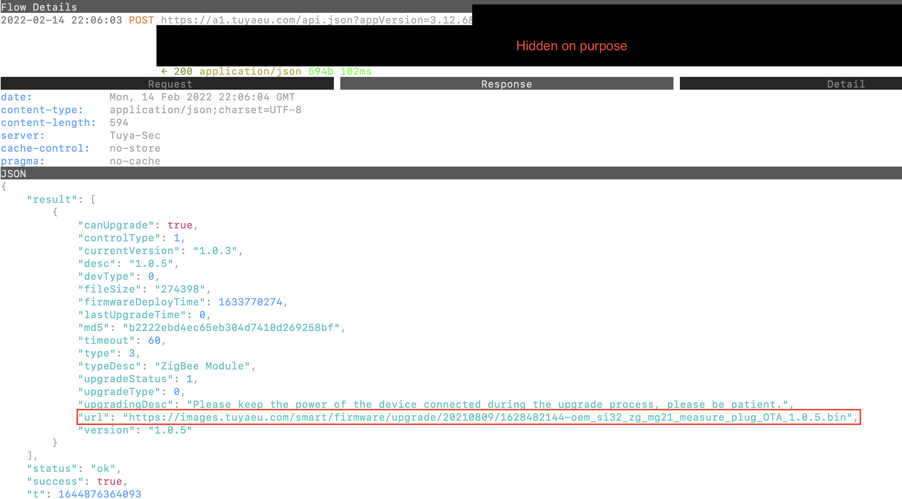

# Get Tuya OTA url
This guide explains how to retrieve a TuYa OTA file for your device. This file can then be used to update your TuYa device via Zigbee2MQTT.

Prerequisites:
- Docker
- TuYa bridge
- [Android Studio](https://developer.android.com/studio)

## Step 1: running the proxy
Execute the following command: `docker run --rm -it -p 8080:8080 mitmproxy/mitmproxy`

## Step 2: setup the Android emulator
Start Android Studio and create a new empty project:
1. File -> New -> New Project...
1. Phone and Tablet -> Empty Activity -> Next
1. Finish
1. Click on the emulator ("Pixel_3a_..." in the case below) -> Device Manager   
1. Click on the pencil icon of the device, under "Show Advanced Settings" change the "Internal Storage" to "2000". Click "Finish".
1. Start the emulator by clicking the play icon.   
1. On the emulator, go to Settings -> Network & internet -> Internet -> AndroidWifi -> Edit (pencil right top) -> Advanced options -> Proxy -> Manual. For proxy host name fill in the IP address of your computer (e.g. 192.168.2.145), for port fill in 8080. Save.
1. Open Chrome on the emulator, go to http://mitm.it and click on "Get mitmproxy-ca-cert.cer" under Android.
1. Go to settings again, Security -> Encryption & credentials -> Install a certificate -> CA certificate -> Install anyway -> Drawer icon -> Downloads -> click on the downloaded certificate.
1. Download the TuYa app apk from [this link](https://aapks.com/download.php?dl=48267761) (IMPORTANT: newer version don't work, tested with 3.12.6). Drag the downloaded apk on the emulator (which will install it).

## Step 3: get the OTA url
1. Open the TuYa Smart Life app in the emulator, log in with your account
1. Make sure the TuYa bridge + the device you want to get the OTA of is already coupled to your account, this cannot be done from the emulator so use your phone for this. Make sure to use the same app on your phone, otherwise the device will not show up (e.g. for iOS use [this](https://apps.apple.com/nl/app/smart-life-smart-living/id1115101477), [**not this**](https://apps.apple.com/nl/app/tuya-smart/id1034649547)).
1. Click on the device -> edit (pencil icon right top). Click "Check for Firmware Upgrade".
1. If an firmware upgarde is available, quickly go back to the output of mitm (step 1), click on the latest request (yes you can click in the console window). This will show your the OTA url (see red box below).
    - Tip: to go back to the overview of requests press the `Q` key on your keyboard.

## Step 4: add OTA to zigbee-ota
1. Follow [this guide](https://github.com/koenkk/zigbee-ota#adding-new-and-updating-existing-ota-files) to add the OTA to the [zigbee-OTA](https://github.com/koenkk/zigbee-ota) repository. 
1. Enable the ota by adding `ota: ota.zigbeeOTA` to your device definition ([example](https://github.com/Koenkk/zigbee-herdsman-converters/blob/3e45f8f13b419ea8ce33fb3d30b11f5ac1bdec08/devices/tuya.js#L1172)).