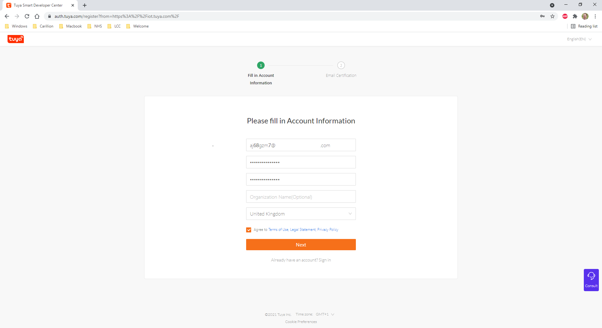
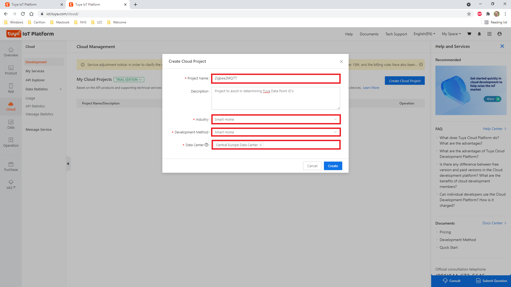
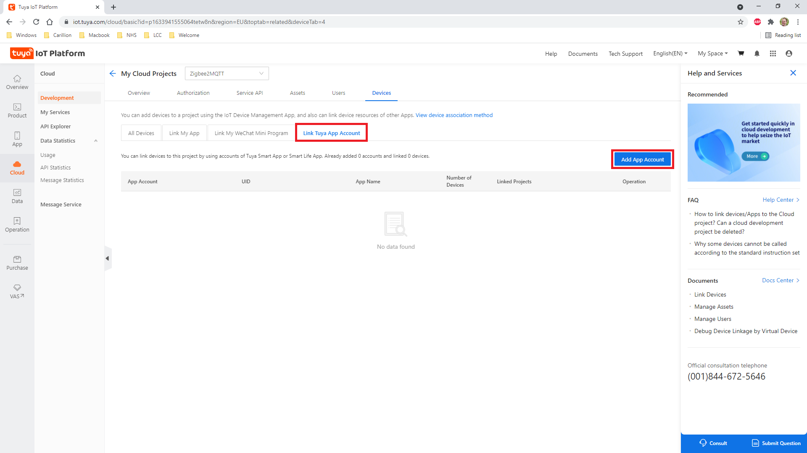
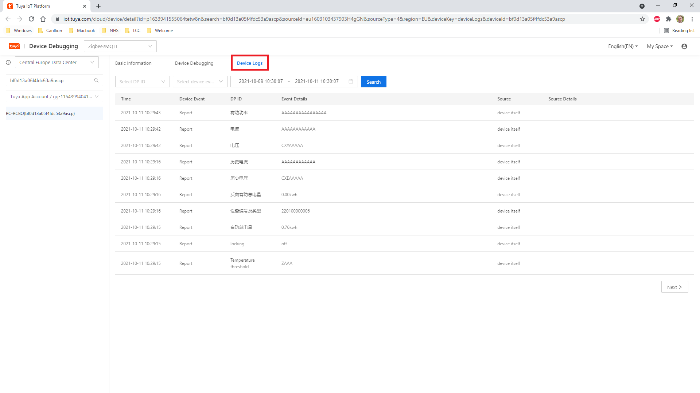
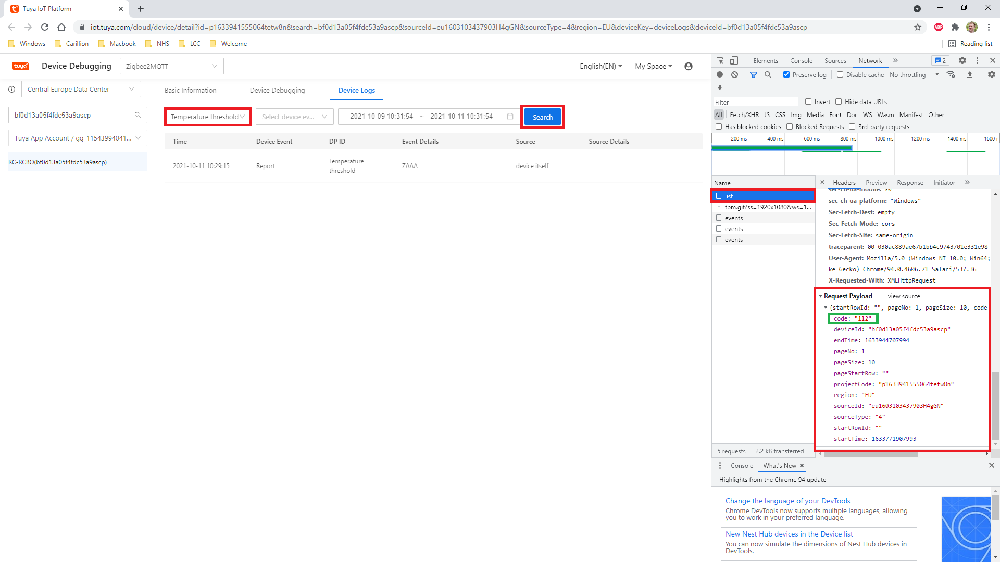

# Find Tuya Data Points
Tuya devices use a custom `manuSpecificTuya` cluster. Within the reported values of this cluster's data is a dp (so called “Data Point ID”) which is at the core of Tuya devices. From the point of view of a device the DPIDs are the functions that the device provides. The instructions below will help you use the Tuya IoT Platform with a Tuya gateway to determine the functions of the datapoints which, will later assist in the creation of a device converter.

## Requirements and caveats
1. You will need an up-to-date version of Google Chrome (other browsers may work but, instructions may differ)
2. You will require basic knowledge of using Chrome and its Dev Tools
3. You will need to sign up for the Tuya IoT Platform and bind your accounts (more details below)
4. You will require a Tuya Zigbee Gateway
5. You will need the Tuya app (with the orange icon) installed on your mobile device

## Instructions
### 1. Standard part of the setup
Ensure that you have set up a Tuya account and bound your Zigbee device to the Tuya gateway (these instructions will assume this has already been done).

### 2. Signin up for Tuya IoT Platform
The Tuya IoT Platform is the backbone for how internet connected Tuya devices communicate back to the Tuya platform. It contains a suite of Application Programming Interfaces (API's) which allow for developers to embed the Tuya functionality within their own platforms.

Visit [Tuya IoT Platform](https://iot.tuya.com/) and sign up for a new account (if you don't already have one):



### 3. Login
Use your new credentials to login to the Tuya IoT Platform. You will be greeted with a first time tutorial showing you around the platform. At the end of the tutorial select `Individual Developer`. If you miss this, click on the `person` icon in the right-top -> `Account` and set `Account Type` to `Individual Developer`.

### 4. Create a cloud project
Click on `Cloud` in the side menu, `Development` in the sub-menu and then click on `Create Cloud Project`.


In the newly opened dialog box, fill in the details as required, enduring that the Development Method is selected as Smart Home, and the Data Center corresponds to the region that your Tuya account is associated with.



Once confirmed, a new dialog box will open. Next to `Select API Services`, click `All`, click `Authorize`.

### 5. Link your Tuya account with your new Tuya project
Once confirmed, you should be taken to your new Tuya project. Click on, `Devices`, `Link Tuya App Account`, then `Add App Account`.



This should bring up a QR code. Go in to the Tuya app on your mobile device, click on `[+]` (as id you are adding a new device). At the top of the screen, you will see a scan barcode button `[-]`. Click the `[-]` button and give permissions to use the camera (if prompted). Scan the QR code with your mobile device, and press `Confirm login`. On your computer a pop-up `Link Tuya App Account` will be shown. Set `Device Linking Method` to `Automatic Link`, `Device Permission` to `Read, write, and Manage` and click `Ok`. You will get a pop-up showing the amount of devices was added, close this.

### 6. Find your devices
Click on the `All Devices` and find the device in-which you wish to find the Data Points. Click on `Debug Device`. If you do not find your device in the list, or the list is empty, please check your project's region.


### 7. Display device logs
Click on the `Device Logs` tab, and you will see a list of all events that the device has sent to the Tuya platform. Ignore the Event Details section as this appears to be garbage.



### 8. Find your Data Point!!

#### **Automatic**

Once on the `Device Logs` tab, open up Dev Tools by pressing `ctrl` + `shift` + `i` on your keyboard, or going to the `3-dot menu` at the top-right of the Chrome window->`More Tools`->`Dev Tools`. When Dev Tools is open, click on the `Console` Tab, then paste the code below in to the console and press `Enter` on your keyboard. Next, open the `DP ID` drop-down list and hover over each item. The running code will automatically fetch the data point ID for each item. Once you have finished, run `export_codes()` in the console. This will output the data point ID-Name correspondences.

> WARNING: Never run code that you do not understand. It is your responsibility to ensure that you understand what the code is doing before running it.

The code of the selected/hovered data point ID in the drop-down list as well as the previous and the next IDs are stored in the DOM under `<div id="code_list">`. The code below fetches these three codes each time the div is updated and stores them in the dictionary `codes`.

```javascript
function waitForElm(selector) {
    /** Wait for an HTML element to appear in the DOM.
     * 
     * Answer of Yong Wang (https://stackoverflow.com/users/4556536/yong-wang) to
     * https://stackoverflow.com/questions/5525071/how-to-wait-until-an-element-exists
     */
    return new Promise(resolve => {
        if (document.querySelector(selector)) return resolve(document.querySelector(selector));

        const observer = new MutationObserver(mutations => {
            if (document.querySelector(selector)) {
                resolve(document.querySelector(selector));
                observer.disconnect();
            }
        });

        observer.observe(document.body, {childList: true, subtree: true});
    });
}

let codes_selector = "#code_list";
let codes = {};

// Wait for the code list to appear in the DOM.
waitForElm(codes_selector).then((elm) => {
    // Create an observer to watch for changes and update the codes dictionary.
    var observer = new MutationObserver(mutations => {
        let code_items = document.getElementById("code_list").getElementsByTagName("div");
        for (const code_item of code_items) {
            codes[code_item.textContent] = code_item.getAttribute("aria-label");
        }
    });

    observer.observe(document.querySelector(codes_selector), {childList: true});
});


function export_codes() {
    /** Export the codes dictionary to the console in a copy-friendly format. */
    let codes_str = JSON.stringify(codes);
    console.log(codes_str);
}
```

#### **Manual**

Select the Data Point for-which you wish to find the ID for in the drop-down list above the events table. Open up Dev Tools by pressing `ctrl` + `shift` + `i` on your keyboard, or going to the `3-dot menu` at the top-right of the Chrome window->`More Tools`->`Dev Tools`. When Dev Tools is open, click on the `Network` Tab, then click the `Search` button in the Tuya IoT Platform window.



You should see a number of calls appear in the `Name` section of Dev Tools. The call that we are interested in it `list`. Click this, and scroll down in the right-hand pane until you see the `Request Payload` section. Within there, is a json encoded object which contains all of the data sent from the search function. One of the keys is labelled `code`. This `code` i.e. 112 is the value for your Data Point ID!

### 9. Rinse, and repeat!

You should now iterate through each of the Data Points that are available in the drop-down list. Once finished, follow the other How-To guides to map these Data Point's into converters.
