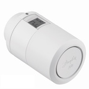

*To contribute to this page, edit the following
[file](https://github.com/Koenkk/zigbee2mqtt.io/blob/master/docs/devices/014G2461.md)*

# Danfoss 014G2461

| Model | 014G2461  |
| Vendor  | Danfoss  |
| Description | Ally thermostat |
| Exposes | battery, lock (state), mounted_mode, heat_required, window_open_internal, setpoint_change_source, climate (occupied_heating_setpoint, local_temperature, pi_heating_demand), linkquality |
| Picture |  |

## Notes


### Pairing
* Install the device on the valve. Insert the batteries (and M will display).
* Push the "o" button for 5 seconds to calibrate the valve motor.
* Push the "o" button for briefly to enter Pairing mode (can take upto 60 seconds).

To factory reset:
* Remove one battery.
* Press and hold "o" button.
* Insert battery and hold button pressed for about 3 seconds (display will flash all symbols).

### Device type specific configuration
*[How to use device type specific configuration](../information/configuration.md)*

* `legacy`: Set to `false` to disable the legacy integration (highly recommended!) (default: true)


## OTA updates
This device supports OTA updates, for more information see [OTA updates](../information/ota_updates.md).


## Exposes

### Battery (numeric)
Remaining battery in %.
Value can be found in the published state on the `battery` property.
It's not possible to read (`/get`) or write (`/set`) this value.
The minimal value is `0` and the maximum value is `100`.
The unit of this value is `%`.

### Lock 
The current state of this lock is in the published state under the `keypad_lockout` property (value is `1` or `0`).
To control this lock publish a message to topic `zigbee2mqtt/FRIENDLY_NAME/set` with payload `{"keypad_lockout": "1"}` or `{"keypad_lockout": "0"}`.
To read the current state of this lock publish a message to topic `zigbee2mqtt/FRIENDLY_NAME/get` with payload `{"keypad_lockout": ""}`.

### Mounted_mode (binary)
Mode in which the unit is mounted. This is set to `false` for normal mounting or `true` for vertical mounting.
Value can be found in the published state on the `mounted_mode` property.
It's not possible to read (`/get`) or write (`/set`) this value.
If value equals `true` mounted_mode is ON, if `false` OFF.

### Heat_required (binary)
Wether or not the unit needs warm water.
Value can be found in the published state on the `heat_required` property.
It's not possible to read (`/get`) or write (`/set`) this value.
If value equals `true` heat_required is ON, if `false` OFF.

### Window_open_internal (binary)
Most likely related to the option to set Window Detection mode.
Value can be found in the published state on the `window_open_internal` property.
It's not possible to read (`/get`) or write (`/set`) this value.
If value equals `1` window_open_internal is ON, if `0` OFF.

### Setpoint_change_source (binary)
Values observed are `0` (set locally) or `2` (set via Zigbee).
Value can be found in the published state on the `setpoint_change_source` property.
It's not possible to read (`/get`) or write (`/set`) this value.
If value equals `0` setpoint_change_source is ON, if `1` OFF.

### Climate 
This climate device supports the following features: `occupied_heating_setpoint`, `local_temperature`, `pi_heating_demand`.
- `occupied_heating_setpoint`: Temperature setpoint. To control publish a message to topic `zigbee2mqtt/FRIENDLY_NAME/set` with payload `{"occupied_heating_setpoint": VALUE}` where `VALUE` is the °C between `6` and `28`. To read send a message to `zigbee2mqtt/FRIENDLY_NAME/get` with payload `{"occupied_heating_setpoint": ""}`.
- `local_temperature`: Current temperature measured on the device (in °C). To read send a message to `zigbee2mqtt/FRIENDLY_NAME/get` with payload `{"local_temperature": ""}`.

### Linkquality (numeric)
Link quality (signal strength).
Value can be found in the published state on the `linkquality` property.
It's not possible to read (`/get`) or write (`/set`) this value.
The minimal value is `0` and the maximum value is `255`.
The unit of this value is `lqi`.

## Manual Home Assistant configuration
Although Home Assistant integration through [MQTT discovery](../integration/home_assistant) is preferred,
manual integration is possible with the following configuration:



```yaml
sensor:
  - platform: "mqtt"
    state_topic: "zigbee2mqtt/<FRIENDLY_NAME>"
    availability_topic: "zigbee2mqtt/bridge/state"
    value_template: "{{ value_json.battery }}"
    unit_of_measurement: "%"
    device_class: "battery"

lock:
  - platform: "mqtt"
    state_topic: true
    availability_topic: "zigbee2mqtt/bridge/state"
    command_topic: "zigbee2mqtt/<FRIENDLY_NAME>/set"
    value_template: "{{ value_json.keypad_lockout }}"
    payload_lock: "1"
    payload_unlock: "0"
    command_topic_postfix: "keypad_lockout"

binary_sensor:
  - platform: "mqtt"
    state_topic: "zigbee2mqtt/<FRIENDLY_NAME>"
    availability_topic: "zigbee2mqtt/bridge/state"
    value_template: "{{ value_json.mounted_mode }}"
    payload_on: true
    payload_off: false

binary_sensor:
  - platform: "mqtt"
    state_topic: "zigbee2mqtt/<FRIENDLY_NAME>"
    availability_topic: "zigbee2mqtt/bridge/state"
    value_template: "{{ value_json.heat_required }}"
    payload_on: true
    payload_off: false

binary_sensor:
  - platform: "mqtt"
    state_topic: "zigbee2mqtt/<FRIENDLY_NAME>"
    availability_topic: "zigbee2mqtt/bridge/state"
    value_template: "{{ value_json.window_open_internal }}"
    payload_on: 1
    payload_off: 0

binary_sensor:
  - platform: "mqtt"
    state_topic: "zigbee2mqtt/<FRIENDLY_NAME>"
    availability_topic: "zigbee2mqtt/bridge/state"
    value_template: "{{ value_json.setpoint_change_source }}"
    payload_on: 0
    payload_off: 1

climate:
  - platform: "mqtt"
    availability_topic: "zigbee2mqtt/bridge/state"
    temperature_unit: "C"
    temp_step: 0.5
    min_temp: "6"
    max_temp: "28"
    current_temperature_topic: true
    current_temperature_template: "{{ value_json.local_temperature }}"
    temperature_command_topic: "occupied_heating_setpoint"
    temperature_state_template: "{{ value_json.occupied_heating_setpoint }}"
    temperature_state_topic: true

sensor:
  - platform: "mqtt"
    state_topic: "zigbee2mqtt/<FRIENDLY_NAME>"
    availability_topic: "zigbee2mqtt/bridge/state"
    value_template: "{{ value_json.linkquality }}"
    unit_of_measurement: "lqi"
    icon: "mdi:signal"

sensor:
  - platform: "mqtt"
    state_topic: "zigbee2mqtt/<FRIENDLY_NAME>"
    availability_topic: "zigbee2mqtt/bridge/state"
    icon: "mdi:update"
    value_template: "{{ value_json['update']['state'] }}"

binary_sensor:
  - platform: "mqtt"
    state_topic: "zigbee2mqtt/<FRIENDLY_NAME>"
    availability_topic: "zigbee2mqtt/bridge/state"
    payload_on: true
    payload_off: false
    value_template: "{{ value_json.update_available}}"
```



