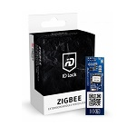

*To contribute to this page, edit the following
[file](https://github.com/Koenkk/zigbee2mqtt.io/blob/master/docs/devices/0402946.md)*

# ID LOCK 150

| Model | 0402946  |
| Vendor  | Datek  |
| Description | Zigbee module for ID LOCK 150 Smart Lock |
| Exposes | lock (state & lock_state), door_state, sound_volume, master_pin_mode, rfid_enable, lock_mode, 
service_mode, relock_enabled, battery, linkquality |
| Picture |  |

## Notes


### Pairing
If pairing failed, try the followings:
- Make sure door are in open state
- Press and hold manual lock button and wait for 3 beeps
- Keypad in front lights up
- Type inn the Master PIN, then *, then 2, then *, then 0
Lock will now reset the Zigbee module and go to pairing mode 

### PIN Code Usage
To retrieve the state, send a `get` message to the device topic (`zigbee2mqtt/DEVICE_FRIENDLY_NAME/get`) with the body `{"pin_code":{"user":1}}`. To set, send a `set` message to the device topic (`zigbee2mqtt/DEVICE_FRIENDLY_NAME/set`) with the body `{"pin_code":{"user":1,"pin_code":1234}}`. To clear a code, send a `set` message with the body `{"pin_code":{"user":1}}`

### Device type specific configuration
*[How to use device type specific configuration](../information/configuration.md)*

* `expose_pin`: Allows to retrieve the `pin_code` value, rather than just user status (`available`/`enabled`), for `pin_code` endpoints (default: `false`) in `devices.yaml`

Example:

```yaml
'0x680ae2fffe6bb522':
  friendly_name: '0x680ae2fffe6bb522'
  expose_pin: true
```


### Manual
[ID LOCK 150 user manual](https://idlock.no/wp-content/uploads/2018/03/20180123-001-IDL150-UserManual.pdf)
[Zigbee module user manual](https://idlock.no/wp-content/uploads/2020/11/User-Manual-Zigbee-module_EN_v0.4.pdf)

### Where do I find this product
[Product page](https://shop.evasmart.no/produkt/smarthus/id-lock-dorlaspakke)


## Exposes

### Lock 
The current state of this lock is in the published state under the `state` property (value is `LOCK` or `UNLOCK`).
To control this lock publish a message to topic `zigbee2mqtt/FRIENDLY_NAME/set` with payload `{"state": "LOCK"}` or `{"state": "UNLOCK"}`.
To read the current state of this lock publish a message to topic `zigbee2mqtt/FRIENDLY_NAME/get` with payload `{"state": ""}`.
This lock exposes a lock state which can be found in the published state under the `lock_state` property. It's not possible to read (`/get`) or write (`/set`) this value. The possible values are: `not_fully_locked`, `locked`, `unlocked`.

- door_state      : Show if the door are physical open or closed
- sound_volume    : Control the sound volume of the lock: Silent, Low or High
- master_pin_mode : Enable/Disable the use of Master PIN to unlock the door
- rfid_enable     : Enable/Disable usage of RFID tag to unlock the door
- service_mode    : Set Service Mode, Random PIN valid for 1 time use or valid for 24 hrs
- lock_mode       : Home Manual, Home Automatic, Away Manual, Away Automatic (Away Mode)
- relock_enabled  : Relock after 16 seconds if unlocked without opening the door

* Please Note: You cannot disable `master_pin_mode` unless you have set at least one regular `user PIN`

For further information, links to the user manuals are provided above. 


## Home Assistant configuration
Home Assistant integration will through [MQTT discovery](../integration/home_assistant) automatically configure all `binary_sensor` and `sensor` for you.

