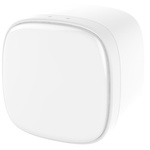

*To contribute to this page, edit the following
[file](https://github.com/Koenkk/zigbee2mqtt.io/blob/master/docs/devices/07047L.md)*

# Immax 07047L

| Model | 07047L  |
| Vendor  | Immax  |
| Description | Intelligent motion sensor |
| Supports | occupancy, temperature, illuminance, humidity |
| Picture |  |

## Notes


### Device type specific configuration
*[How to use device type specific configuration](../information/configuration.md)*


* `illuminance_lux_precision`: Controls the precision of `illuminance_lux` values, e.g. `0` or `1`; default `1`.
To control the precision based on the illuminance_lux value set it to e.g. `{1000: 0, 100: 1}`,
when illuminance_lux >= 1000 precision will be 0, when illuminance_lux >= 100 precision will be 1.


* `illuminance_lux_calibration`: Allows to manually calibrate illuminance values,
e.g. `95` would take 95% to the illuminance reported by the device; default `100`.


* `temperature_precision`: Controls the precision of `temperature` values,
e.g. `0`, `1` or `2`; default `2`.
To control the precision based on the temperature value set it to e.g. `{30: 0, 10: 1}`,
when temperature >= 30 precision will be 0, when temperature >= 10 precision will be 1.
* `temperature_calibration`: Allows to manually calibrate temperature values,
e.g. `1` would add 1 degree to the temperature reported by the device; default `0`.


* `humidity_precision`: Controls the precision of `humidity` values, e.g. `0`, `1` or `2`; default `2`.
To control the precision based on the humidity value set it to e.g. `{80: 0, 10: 1}`,
when humidity >= 80 precision will be 0, when humidity >= 10 precision will be 1.


## Manual Home Assistant configuration
Although Home Assistant integration through [MQTT discovery](../integration/home_assistant) is preferred,
manual integration is possible with the following configuration:



```yaml
binary_sensor:
  - platform: "mqtt"
    state_topic: "zigbee2mqtt/<FRIENDLY_NAME>"
    availability_topic: "zigbee2mqtt/bridge/state"
    payload_on: true
    payload_off: false
    value_template: "{{ value_json.occupancy }}"
    device_class: "motion"

binary_sensor:
  - platform: "mqtt"
    state_topic: "zigbee2mqtt/<FRIENDLY_NAME>"
    availability_topic: "zigbee2mqtt/bridge/state"
    payload_on: true
    payload_off: false
    value_template: "{{ value_json.battery_low}}"
    device_class: "battery"

sensor:
  - platform: "mqtt"
    state_topic: "zigbee2mqtt/<FRIENDLY_NAME>"
    availability_topic: "zigbee2mqtt/bridge/state"
    unit_of_measurement: "°C"
    device_class: "temperature"
    value_template: "{{ value_json.temperature }}"

sensor:
  - platform: "mqtt"
    state_topic: "zigbee2mqtt/<FRIENDLY_NAME>"
    availability_topic: "zigbee2mqtt/bridge/state"
    unit_of_measurement: "%"
    device_class: "humidity"
    value_template: "{{ value_json.humidity }}"

sensor:
  - platform: "mqtt"
    state_topic: "zigbee2mqtt/<FRIENDLY_NAME>"
    availability_topic: "zigbee2mqtt/bridge/state"
    unit_of_measurement: "-"
    device_class: "illuminance"
    value_template: "{{ value_json.illuminance }}"

sensor:
  - platform: "mqtt"
    state_topic: "zigbee2mqtt/<FRIENDLY_NAME>"
    availability_topic: "zigbee2mqtt/bridge/state"
    unit_of_measurement: "lx"
    device_class: "illuminance"
    value_template: "{{ value_json.illuminance_lux }}"

sensor:
  - platform: "mqtt"
    state_topic: "zigbee2mqtt/<FRIENDLY_NAME>"
    availability_topic: "zigbee2mqtt/bridge/state"
    icon: "mdi:signal"
    unit_of_measurement: "lqi"
    value_template: "{{ value_json.linkquality }}"
```



