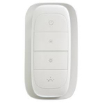

*To contribute to this page, edit the following
[file](https://github.com/Koenkk/zigbee2mqtt.io/blob/master/docs/devices/404002.md)*

# Müller Licht 404002

| Model | 404002  |
| Vendor  | Müller Licht  |
| Description | Tint dim remote control |
| Exposes | action, linkquality |
| Picture |  |

## Notes

### Pairing

Press the small reset button (at backside of the remote at the lower part of the battery lid) e.g. with a pin for about 4 seconds. The device will reset and try to join a network. The LED is switched on during the pairing process. If pairing failes it might work after repeating this procedure and lowering the distance to your Zigbee adapter.

Pairing directly to a nearby (distance ca. 5 cm) Müller Licht Tint bulb is possible by holding down the "power" and "dim down" buttons until the LED starts blinking.

### Device type specific configuration
*[How to use device type specific configuration](../information/configuration.md)*

* `simulated_brightness`: Set to `true` to simulate a `brightness` value (default: `false`).
If this device provides a `brightness_move_up` or `brightness_move_down` action it is possible to specify the update
interval and delta. This can be done by instead of specifying `true`:

```yaml
simulated_brightness:
  delta: 20 # delta per interval, default = 20
  interval: 200 # interval in milliseconds, default = 200
```


## Exposes

### Action (enum)
Triggered action (e.g. a button click).
Value can be found in the published state on the `action` property.
It's not possible to read (`/get`) or write (`/set`) this value.
The possible values are: `on`, `off`, `brightness_step_up`, `brightness_step_down`, `brightness_move_up`, `brightness_move_down`, `brightness_stop`, `recall_1`.

### Linkquality (numeric)
Link quality (signal strength).
Value can be found in the published state on the `linkquality` property.
It's not possible to read (`/get`) or write (`/set`) this value.
The minimal value is `0` and the maximum value is `255`.
The unit of this value is `lqi`.

## Manual Home Assistant configuration
Although Home Assistant integration through [MQTT discovery](../integration/home_assistant) is preferred,
manual integration is possible with the following configuration:



```yaml
sensor:
  - platform: "mqtt"
    state_topic: "zigbee2mqtt/<FRIENDLY_NAME>"
    availability_topic: "zigbee2mqtt/bridge/state"
    value_template: "{{ value_json.action }}"
    icon: "mdi:gesture-double-tap"

sensor:
  - platform: "mqtt"
    state_topic: "zigbee2mqtt/<FRIENDLY_NAME>"
    availability_topic: "zigbee2mqtt/bridge/state"
    unit_of_measurement: "lqi"
    value_template: "{{ value_json.linkquality }}"
    icon: "mdi:signal"
```



