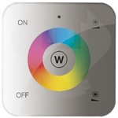

*To contribute to this page, edit the following
[file](https://github.com/Koenkk/zigbee2mqtt.io/blob/master/docs/devices/421782.md)*

# Calex 421782

| Model | 421782  |
| Vendor  | Calex  |
| Description | Zigbee wall mounted RGB controller |
| Exposes | action, linkquality |
| Picture |  |

## Notes

### Pairing instructions

To pair this device follow these steps.

1. reset it, by pressing `Brightness up` and `Off` for 10 seconds.
2. pair it to zigbee2mqtt by pressing `brightness down` and `On` for 3 seconds.

### Touchlink support

Once paired to zigbee2mqtt, you can also touch link this device to some lights.
Hold it really close (5cm) to a light and press the middle button for 3 seconds.
Repeat for all lights you want to control.

### Device type specific configuration

*[How to use device type specific configuration](../information/configuration.md)*

* `simulated_brightness`: Set to `true` to simulate a `brightness` value (default: `false`).
If this device provides a `brightness_move_up` or `brightness_move_down` action it is possible to specify the update
interval and delta. This can be done by instead of specifying `true`:

```yaml
simulated_brightness:
  delta: 20 # delta per interval, default = 20
  interval: 200 # interval in milliseconds, default = 200
```

## Exposes

### Battery (numeric)

Remaining battery in %.
Value can be found in the published state on the `battery` property.
It's not possible to read (`/get`) or write (`/set`) this value.
The minimal value is `0` and the maximum value is `100`.
The unit of this value is `%`.

### Action (enum)

Triggered action (e.g. a button click).
Value can be found in the published state on the `action` property.
It's not possible to read (`/get`) or write (`/set`) this value.
The possible values are: `color_move`, `color_temperature_move`, `hue_move`, `brightness_step_up`, `brightness_step_down`, `recall_*`, `on`, `off`.

### Linkquality (numeric)

Link quality (signal strength).
Value can be found in the published state on the `linkquality` property.
It's not possible to read (`/get`) or write (`/set`) this value.
The minimal value is `0` and the maximum value is `255`.
The unit of this value is `lqi`.

## Manual Home Assistant configuration

Although Home Assistant integration through [MQTT discovery](../integration/home_assistant) is preferred,
manual integration is possible with the following configuration:


```yaml
sensor:

sensor:
  - platform: "mqtt"
    state_topic: "zigbee2mqtt/<FRIENDLY_NAME>"
    availability_topic: "zigbee2mqtt/bridge/state"
    value_template: "{{ value_json.action }}"
    icon: "mdi:gesture-double-tap"

sensor:
  - platform: "mqtt"
    state_topic: "zigbee2mqtt/<FRIENDLY_NAME>"
    availability_topic: "zigbee2mqtt/bridge/state"
    unit_of_measurement: "lqi"
    value_template: "{{ value_json.linkquality }}"
    icon: "mdi:signal"
```

