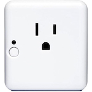

*To contribute to this page, edit the following
[file](https://github.com/Koenkk/zigbee2mqtt.io/blob/master/docs/devices/4257050-RZHAC.md)*

# Centralite 4257050-RZHAC

| Model | 4257050-RZHAC  |
| Vendor  | Centralite  |
| Description | 3-Series smart outlet |
| Exposes | switch (state), power, current, voltage, linkquality |
| Picture |  |

## Notes

None


## Exposes

### Switch 
The current state of this switch is in the published state under the `state` property (value is `ON` or `OFF`).
To control this switch publish a message to topic `zigbee2mqtt/FRIENDLY_NAME/set` with payload `{"state": "ON"}`, `{"state": "OFF"}` or `{"state": "TOGGLE"}`.
To read the current state of this switch publish a message to topic `zigbee2mqtt/FRIENDLY_NAME/get` with payload `{"state": ""}`.

### Power (numeric)
Instantaneous measured power.
Value can be found in the published state on the `power` property.
It's not possible to read (`/get`) or write (`/set`) this value.
The unit of this value is `W`.

### Current (numeric)
Instantaneous measured electrical current.
Value can be found in the published state on the `current` property.
It's not possible to read (`/get`) or write (`/set`) this value.
The unit of this value is `A`.

### Voltage (numeric)
Measured electrical potential value.
Value can be found in the published state on the `voltage` property.
It's not possible to read (`/get`) or write (`/set`) this value.
The unit of this value is `V`.

### Linkquality (numeric)
Link quality (signal strength).
Value can be found in the published state on the `linkquality` property.
It's not possible to read (`/get`) or write (`/set`) this value.
The minimal value is `0` and the maximum value is `255`.
The unit of this value is `lqi`.

## Manual Home Assistant configuration
Although Home Assistant integration through [MQTT discovery](../integration/home_assistant) is preferred,
manual integration is possible with the following configuration:



```yaml
switch:
  - platform: "mqtt"
    state_topic: "zigbee2mqtt/<FRIENDLY_NAME>"
    availability_topic: "zigbee2mqtt/bridge/state"
    payload_off: "OFF"
    payload_on: "ON"
    value_template: "{{ value_json.state }}"
    command_topic: "zigbee2mqtt/<FRIENDLY_NAME>/set"

sensor:
  - platform: "mqtt"
    state_topic: "zigbee2mqtt/<FRIENDLY_NAME>"
    availability_topic: "zigbee2mqtt/bridge/state"
    value_template: "{{ value_json.power }}"
    unit_of_measurement: "W"
    device_class: "power"

sensor:
  - platform: "mqtt"
    state_topic: "zigbee2mqtt/<FRIENDLY_NAME>"
    availability_topic: "zigbee2mqtt/bridge/state"
    value_template: "{{ value_json.current }}"
    unit_of_measurement: "A"
    device_class: "current"

sensor:
  - platform: "mqtt"
    state_topic: "zigbee2mqtt/<FRIENDLY_NAME>"
    availability_topic: "zigbee2mqtt/bridge/state"
    value_template: "{{ value_json.voltage }}"
    unit_of_measurement: "V"
    device_class: "voltage"

sensor:
  - platform: "mqtt"
    state_topic: "zigbee2mqtt/<FRIENDLY_NAME>"
    availability_topic: "zigbee2mqtt/bridge/state"
    value_template: "{{ value_json.linkquality }}"
    unit_of_measurement: "lqi"
    icon: "mdi:signal"
```



