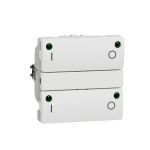

*To contribute to this page, edit the following
[file](https://github.com/Koenkk/zigbee2mqtt.io/blob/master/docs/devices/545D6514.md)*

# LK by Schneider Electric 545D6514, 545D0514

| Model | 545D6514, 545D0514  |
| Vendor | Schneider Electric  |
| Description | LK FUGA Wiser Wireless Double Relay |
| Exposes | switch (state), action, linkquality |
| Picture |  |

## Notes

### Device type specific configuration
*[How to use device type specific configuration](../information/configuration.md)*

* `legacy`: Set to `false` to disable the legacy integration (highly recommended!) (default: true)


## Exposes

### Switch (l1 endpoint)
The current state of this switch is in the published state under the `state_l1` property (value is `ON` or `OFF`).
To control this switch publish a message to topic `zigbee2mqtt/FRIENDLY_NAME/set` with payload `{"state_l1": "ON"}`, `{"state_l1": "OFF"}` or `{"state_l1": "TOGGLE"}`.
To read the current state of this switch publish a message to topic `zigbee2mqtt/FRIENDLY_NAME/get` with payload `{"state_l1": ""}`.

### Switch (l2 endpoint)
The current state of this switch is in the published state under the `state_l2` property (value is `ON` or `OFF`).
To control this switch publish a message to topic `zigbee2mqtt/FRIENDLY_NAME/set` with payload `{"state_l2": "ON"}`, `{"state_l2": "OFF"}` or `{"state_l2": "TOGGLE"}`.
To read the current state of this switch publish a message to topic `zigbee2mqtt/FRIENDLY_NAME/get` with payload `{"state_l2": ""}`.

### Action (enum)
Triggered action (e.g. a button click).
Value can be found in the published state on the `action` property.
It's not possible to read (`/get`) or write (`/set`) this value.
The possible values are: `on_s1`, `off_s2`, `on_s3`, `off_s4`.

### Linkquality (numeric)
Link quality (signal strength).
Value can be found in the published state on the `linkquality` property.
It's not possible to read (`/get`) or write (`/set`) this value.
The minimal value is `0` and the maximum value is `255`.
The unit of this value is `lqi`.

## Manual Home Assistant configuration
Although Home Assistant integration through [MQTT discovery](../integration/home_assistant) is preferred,
manual integration is possible with the following configuration:



```yaml
switch:
  - platform: "mqtt"
    state_topic: "zigbee2mqtt/<FRIENDLY_NAME>"
    availability_topic: "zigbee2mqtt/bridge/state"
    payload_off: "OFF"
    payload_on: "ON"
    value_template: "{{ value_json.state_l1 }}"
    command_topic: "zigbee2mqtt/<FRIENDLY_NAME>/l1/set"

switch:
  - platform: "mqtt"
    state_topic: "zigbee2mqtt/<FRIENDLY_NAME>"
    availability_topic: "zigbee2mqtt/bridge/state"
    payload_off: "OFF"
    payload_on: "ON"
    value_template: "{{ value_json.state_l2 }}"
    command_topic: "zigbee2mqtt/<FRIENDLY_NAME>/l2/set"

sensor:
  - platform: "mqtt"
    state_topic: "zigbee2mqtt/<FRIENDLY_NAME>"
    availability_topic: "zigbee2mqtt/bridge/state"
    value_template: "{{ value_json.action }}"
    icon: "mdi:gesture-double-tap"

sensor:
  - platform: "mqtt"
    state_topic: "zigbee2mqtt/<FRIENDLY_NAME>"
    availability_topic: "zigbee2mqtt/bridge/state"
    value_template: "{{ value_json.linkquality }}"
    unit_of_measurement: "lqi"
    icon: "mdi:signal"
```



