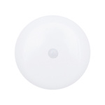

*To contribute to this page, edit the following
[file](https://github.com/Koenkk/zigbee2mqtt.io/blob/master/docs/devices/5AA-SS-ZA-H0.md)*

# Leedarson 5AA-SS-ZA-H0

| Model | 5AA-SS-ZA-H0  |
| Vendor  | Leedarson  |
| Description | Motion sensor |
| Exposes | occupancy, illuminance, illuminance_lux, linkquality |
| Picture |  |

## Notes

### Device type specific configuration
*[How to use device type specific configuration](../information/configuration.md)*

* `illuminance_lux_precision`: Controls the precision of `illuminance_lux` values, e.g. `0` or `1`; default `1`.
To control the precision based on the illuminance_lux value set it to e.g. `{1000: 0, 100: 1}`,
when illuminance_lux >= 1000 precision will be 0, when illuminance_lux >= 100 precision will be 1.


* `illuminance_lux_calibration`: Allows to manually calibrate illuminance values,
e.g. `95` would take 95% to the illuminance reported by the device; default `100`.


## Exposes
### Occupancy (binary)
Indicates whether the device detected occupancy.
Value can be found in the published state on the `occupancy` property.
It's not possible to read (`/get`) or write (`/set`) this value.
If value equals `true` occupancy is ON, if `false` OFF.

### Illuminance (numeric)
Raw measured illuminance.
Value can be found in the published state on the `illuminance` property.
It's not possible to read (`/get`) or write (`/set`) this value.

### Illuminance_lux (numeric)
Measured illuminance in lux.
Value can be found in the published state on the `illuminance_lux` property.
It's not possible to read (`/get`) or write (`/set`) this value.
The unit of this value is `lx`.

### Linkquality (numeric)
Link quality (signal strength).
Value can be found in the published state on the `linkquality` property.
It's not possible to read (`/get`) or write (`/set`) this value.
The minimal value is `0` and the maximum value is `255`.
The unit of this value is `lqi`.

## Manual Home Assistant configuration
Although Home Assistant integration through [MQTT discovery](../integration/home_assistant) is preferred,
manual integration is possible with the following configuration:



```yaml
binary_sensor:
  - platform: "mqtt"
    state_topic: "zigbee2mqtt/<FRIENDLY_NAME>"
    availability_topic: "zigbee2mqtt/bridge/state"
    value_template: "{{ value_json.occupancy }}"
    payload_on: true
    payload_off: false
    device_class: "motion"

sensor:
  - platform: "mqtt"
    state_topic: "zigbee2mqtt/<FRIENDLY_NAME>"
    availability_topic: "zigbee2mqtt/bridge/state"
    unit_of_measurement: "-"
    value_template: "{{ value_json.illuminance }}"
    device_class: "illuminance"

sensor:
  - platform: "mqtt"
    state_topic: "zigbee2mqtt/<FRIENDLY_NAME>"
    availability_topic: "zigbee2mqtt/bridge/state"
    unit_of_measurement: "lx"
    value_template: "{{ value_json.illuminance_lux }}"
    device_class: "illuminance"

sensor:
  - platform: "mqtt"
    state_topic: "zigbee2mqtt/<FRIENDLY_NAME>"
    availability_topic: "zigbee2mqtt/bridge/state"
    unit_of_measurement: "lqi"
    value_template: "{{ value_json.linkquality }}"
    icon: "mdi:signal"
```



