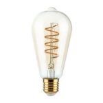

*To contribute to this page, edit the following
[file](https://github.com/Koenkk/zigbee2mqtt.io/blob/master/docs/devices/HG06463A.md)*

# Lidl HG06463A

| Model | HG06463A  |
| Vendor  | Lidl  |
| Description | Livarno Lux E27 LED bulb filament ST64 |
| Exposes | light (state, brightness), linkquality |
| Picture |  |

## Notes


### Pairing
Factory reset the light bulb. After resetting the bulb will automatically connect.

Factory reset the light bulb.
After resetting the bulb will automatically connect.

One option that might work is to use (very) short “on’s” and a little bit longer “off’s”, where you kill the light as soon as the bulb shows signs of turning on.
Start with bulb on, then off, and then 3 “on’s”, wait in the 3rd ON state.
Alternatively, start with the bulb on, and then repeat the off on sequence as above, but wait 2-3 seconds in each state (on and off).
When in pairing state, the bulb will flash.


## Exposes

### Light 
This light supports the following features: `state`, `brightness`.
- `state`: To control the state publish a message to topic `zigbee2mqtt/FRIENDLY_NAME/set` with payload `{"state": "ON"}`, `{"state": "OFF"}` or `{"state": "TOGGLE"}`. To read the state send a message to `zigbee2mqtt/FRIENDLY_NAME/get` with payload `{"state": ""}`.
- `brightness`: To control the brightness publish a message to topic `zigbee2mqtt/FRIENDLY_NAME/set` with payload `{"brightness": VALUE}` where `VALUE` is a number between `0` and `254`. To read the brightness send a message to `zigbee2mqtt/FRIENDLY_NAME/get` with payload `{"brightness": ""}`.

### Linkquality (numeric)
Link quality (signal strength).
Value can be found in the published state on the `linkquality` property.
It's not possible to read (`/get`) or write (`/set`) this value.
The minimal value is `0` and the maximum value is `255`.
The unit of this value is `lqi`.

## Manual Home Assistant configuration
Although Home Assistant integration through [MQTT discovery](../integration/home_assistant) is preferred,
manual integration is possible with the following configuration:



```yaml
light:
  - platform: "mqtt"
    state_topic: "zigbee2mqtt/<FRIENDLY_NAME>"
    availability_topic: "zigbee2mqtt/bridge/state"
    brightness: true
    schema: "json"
    command_topic: "zigbee2mqtt/<FRIENDLY_NAME>/set"
    brightness_scale: 254
    effect: false

sensor:
  - platform: "mqtt"
    state_topic: "zigbee2mqtt/<FRIENDLY_NAME>"
    availability_topic: "zigbee2mqtt/bridge/state"
    value_template: "{{ value_json.linkquality }}"
    unit_of_measurement: "lqi"
    enabled_by_default: false
    icon: "mdi:signal"
    state_class: "measurement"

binary_sensor:
  - platform: "mqtt"
    state_topic: "zigbee2mqtt/<FRIENDLY_NAME>"
    availability_topic: "zigbee2mqtt/bridge/state"
    payload_on: true
    payload_off: false
    value_template: "{{ value_json.update_available}}"
    enabled_by_default: false
```


