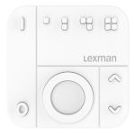

*To contribute to this page, edit the following
[file](https://github.com/Koenkk/zigbee2mqtt.io/blob/master/docs/devices/HR-C99C-Z-C045.md)*

# LEXMAN ENKI Remote control

| Model | HR-C99C-Z-C045 |
| Vendor  | ADEO |
| Description | ZigBee color/hue/saturation/temperature remote control |
| Exposes | action, linkquality, battery |
| Picture |  |
| White-label | Lexman Enki 82473188 |

## Notes

### Pairing
Hold small reset button pressed (located on the backside of remote) for 3
seconds (until the front LED blicks) and device will reset and will attempt to join network.

## Exposes
### Action (enum)
Triggered action (e.g. a button click).
Value can be found in the published state on the `action` property.
It's not possible to read (`/get`) or write (`/set`) this value.
The possible values are: `on`, `off`, `scene_1`, `scene_2`, `scene_3`, `scene_4`,
`color_saturation_step_up`, `color_saturation_step_down`, `color_stop`,
`color_hue_step_up`, `color_hue_step_down`, `color_temperature_step_up`, `color_temperature_step_down`,
`brightness_step_up`, `brightness_step_down`, `brightness_stop`.

### Linkquality (numeric)
Link quality (signal strength).
Value can be found in the published state on the `linkquality` property.
It's not possible to read (`/get`) or write (`/set`) this value.
The minimimal value is `0` and the maximum value is `255`.
The unit of this value is `lqi`.

### Battery (numeric)
Remaining battery in %.
Value can be found in the published state on the `battery` property.
It's not possible to read (`/get`) or write (`/set`) this value.
The minimimal value is `0` and the maximum value is `100`.
The unit of this value is `%`.

## Manual Home Assistant configuration
Although Home Assistant integration through [MQTT discovery](../integration/home_assistant) is preferred,
manual integration is possible with the following configuration:



```yaml
sensor:
  - platform: "mqtt"
    state_topic: "zigbee2mqtt/<FRIENDLY_NAME>"
    availability_topic: "zigbee2mqtt/bridge/state"
    unit_of_measurement: "%"
    value_template: "{{ value_json.battery }}"
    device_class: "battery"

sensor:
  - platform: "mqtt"
    state_topic: "zigbee2mqtt/<FRIENDLY_NAME>"
    availability_topic: "zigbee2mqtt/bridge/state"
    value_template: "{{ value_json.action }}"
    icon: "mdi:gesture-double-tap"

sensor:
  - platform: "mqtt"
    state_topic: "zigbee2mqtt/<FRIENDLY_NAME>"
    availability_topic: "zigbee2mqtt/bridge/state"
    unit_of_measurement: "lqi"
    value_template: "{{ value_json.linkquality }}"
    icon: "mdi:signal"
```


