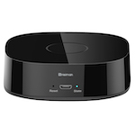

*To contribute to this page, edit the following
[file](https://github.com/Koenkk/zigbee2mqtt.io/blob/master/docs/devices/HS2IRC.md)*

# HEIMAN HS2IRC

| Model | HS2IRC  |
| Vendor  | HEIMAN  |
| Description | Smart IR Control |
| Exposes | battery, linkquality |
| Picture |  |

## Notes


Device can learn up to 15 devices and up to 30 keycodes for each device.

### Configuring
By publishing to `zigbee2mqtt/FRIENDLY_NAME/set` various device attributes can be configured:

#### Create device

Request:
```json
{
    "create": {
        "model_type": 55,
    }
}
```

- **model_type**: User-defined model ID. Used just for reference. Can be `1..255`.

Response:
```json
{
    "action": "create",
    "action_result": "success",
    "action_model_type": 55,
    "action_id": 1,
}
```

- **action_result**: (`success`/`error`). Action result.
- **action_model_type**: User-defined model ID. `1..255`
- **action_id**: Internal device slot ID. Total IR transmitter can store up to 15 devices with ID `1..15`

NOTE: You should call `get_list` manually to refresh `devices` topic.

#### Learn key

Request:
```json
{
    "learn": {
        "id": 1,
        "key_code": 31,
    }
}
```

- **id**: Internal device slot ID. `1..15`.
- **key_code**: Keycode slot ID. `1..30` - Store/replace specific key in speicified slot ID. `>=31` - Create slot ID.

NOTE: You should store keys one-by-one if you specified `key_code` by yourself.

Response:
```json
{
    "action": "learn",
    "action_result": "success",
    "action_key_code": 1,
    "action_id": 1,
}
```

- **action_result**: (`success`/`error`). Action result.
- **action_key_code**: Internal keycode slot ID, where key was stored. `1...30`
- **action_id**: Internal device slot ID. `1..15`

NOTE: You should call `get_list` manually to refresh `devices` topic after learning key.

#### Send stored key

Request:
```json
{
    "send_key": {
        "id": 1,
        "key_code": 1,
    }
}
```

- **id**: Internal device slot ID. `1..15`.
- **key_code**: Keycode slot ID. `1..30`.

#### Get list of the stored devices and keys

Request:
```json
{
    "get_list": ""
}
```

Response:

```json
{
  "devices": [
    {
      "id": 1,
      "key_codes": [
        1,
      ],
      "model_type": 55
    }
  ]
}
```


#### Delete device or keycode

Request:
```json
{
    "delete":{
        "id": 1,
        "key_code": 31
    }
}
```

- **id**: `1..15` - Delete specific device with ID. `>=16` - Delete all devices.
- **key_code**: `1..30` -Delete speicifc keycode. `>=31` - Delete all keycodes for specified device ID.


## Exposes
### Battery (numeric)
Remaining battery in %.
Value can be found in the published state on the `battery` property.
It's not possible to read (`/get`) or write (`/set`) this value.
The minimal value is `0` and the maximum value is `100`.
The unit of this value is `%`.

### Linkquality (numeric)
Link quality (signal strength).
Value can be found in the published state on the `linkquality` property.
It's not possible to read (`/get`) or write (`/set`) this value.
The minimal value is `0` and the maximum value is `255`.
The unit of this value is `lqi`.

## Manual Home Assistant configuration
Although Home Assistant integration through [MQTT discovery](../integration/home_assistant) is preferred,
manual integration is possible with the following configuration:



```yaml
sensor:
  - platform: "mqtt"
    state_topic: "zigbee2mqtt/<FRIENDLY_NAME>"
    availability_topic: "zigbee2mqtt/bridge/state"
    unit_of_measurement: "%"
    value_template: "{{ value_json.battery }}"
    device_class: "battery"

sensor:
  - platform: "mqtt"
    state_topic: "zigbee2mqtt/<FRIENDLY_NAME>"
    availability_topic: "zigbee2mqtt/bridge/state"
    unit_of_measurement: "lqi"
    value_template: "{{ value_json.linkquality }}"
    icon: "mdi:signal"
```



