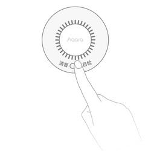

<!-- !!!! -->
<!-- ATTENTION: This file is auto-generated through docgen! -->
<!-- You can only edit the "Notes"-Section between the two comment lines "Notes BEGIN" and "Notes END". -->
<!-- Do not use h1 or h2 heading within "## Notes"-Section. -->
<!-- !!!! -->

# Xiaomi JY-GZ-01AQ

|     |     |
|-----|-----|
| Model | JY-GZ-01AQ  |
| Vendor  | Xiaomi  |
| Description | Aqara smart smoke detector |
| Exposes | smoke, smoke_density, smoke_density_dbm, selftest, test, mute_buzzer, mute, heartbeat_indicator, linkage_alarm, device_temperature, battery, voltage, linkquality |
| Picture |  |

<!-- Notes BEGIN: You can edit here. Add "## Notes" headline if not already present. -->
## Notes

### Adapter firmware
In order for this device to work, at least the following firmware is required on your adapter:
- CC2530/CC2531: [`20211115`](https://github.com/Koenkk/Z-Stack-firmware/tree/Z-Stack_Home_1.2_20211115/20211116/coordinator/Z-Stack_Home_1.2/bin)
- CC1352/CC2652: [`20211114`](https://github.com/Koenkk/Z-Stack-firmware/tree/7c5a6da0c41855d42b5e6506e5e3b496be097ba3/coordinator/Z-Stack_3.x.0/bin)
- CC2538: [`20211222`](https://github.com/jethome-ru/zigbee-firmware/tree/master/ti/coordinator/cc2538_cc2592)
- Conbee II: [`0x26720700`]( http://deconz.dresden-elektronik.de/deconz-firmware/deCONZ_ConBeeII_0x26720700.bin.GCF)

*Note that if you have already paired the device you will need to repair it after upgrading your adapter firmware.*

### Pairing
Quickly press the button three times in a row.
After this the device will automatically join.

*Note: When you fail to pair a device, try replacing the battery, this could solve the problem.*
<!-- Notes END: Do not edit below this line -->

## OTA updates
This device supports OTA updates, for more information see [OTA updates](../guide/usage/ota_updates.md).

## Options
*[How to use device type specific configuration](../guide/configuration/devices-groups.md#specific-device-options)*

* `device_temperature_precision`: Number of digits after decimal point for device_temperature, takes into effect on next report of device. The value must be a number with a minimum value of `0` and with a with a maximum value of `3`

* `device_temperature_calibration`: Calibrates the device_temperature value (absolute offset), takes into effect on next report of device. The value must be a number.

## Exposes

### Smoke (binary)
Indicates whether the device detected smoke.
Value can be found in the published state on the `smoke` property.
To read (`/get`) the value publish a message to topic `zigbee2mqtt/FRIENDLY_NAME/get` with payload `{"smoke": ""}`.
It's not possible to write (`/set`) this value.
If value equals `true` smoke is ON, if `false` OFF.

### Smoke_density (numeric)
Value of smoke concentration.
Value can be found in the published state on the `smoke_density` property.
To read (`/get`) the value publish a message to topic `zigbee2mqtt/FRIENDLY_NAME/get` with payload `{"smoke_density": ""}`.
It's not possible to write (`/set`) this value.

### Smoke_density_dbm (numeric)
Value of smoke concentration in dB/m.
Value can be found in the published state on the `smoke_density_dbm` property.
It's not possible to read (`/get`) or write (`/set`) this value.
The unit of this value is `dB/m`.

### Selftest (enum)
Starts the self-test process (checking the indicator light and buzzer work properly).
Value will **not** be published in the state.
It's not possible to read (`/get`) this value.
To write (`/set`) a value publish a message to topic `zigbee2mqtt/FRIENDLY_NAME/set` with payload `{"selftest": NEW_VALUE}`.
The possible values are: `Test`.

### Test (binary)
Self-test in progress.
Value can be found in the published state on the `test` property.
It's not possible to read (`/get`) or write (`/set`) this value.
If value equals `true` test is ON, if `false` OFF.

### Mute_buzzer (enum)
Mute the buzzer for 80 seconds (buzzer cannot be pre-muted, because this function only works when the alarm is triggered).
Value will **not** be published in the state.
It's not possible to read (`/get`) this value.
To write (`/set`) a value publish a message to topic `zigbee2mqtt/FRIENDLY_NAME/set` with payload `{"mute_buzzer": NEW_VALUE}`.
The possible values are: `Mute`.

### Mute (binary)
Buzzer muted.
Value can be found in the published state on the `mute` property.
To read (`/get`) the value publish a message to topic `zigbee2mqtt/FRIENDLY_NAME/get` with payload `{"mute": ""}`.
It's not possible to write (`/set`) this value.
If value equals `true` mute is ON, if `false` OFF.

### Heartbeat_indicator (binary)
When this option is enabled then in the normal monitoring state, the green indicator light flashes every 60 seconds.
Value can be found in the published state on the `heartbeat_indicator` property.
To read (`/get`) the value publish a message to topic `zigbee2mqtt/FRIENDLY_NAME/get` with payload `{"heartbeat_indicator": ""}`.
To write (`/set`) a value publish a message to topic `zigbee2mqtt/FRIENDLY_NAME/set` with payload `{"heartbeat_indicator": NEW_VALUE}`.
If value equals `true` heartbeat_indicator is ON, if `false` OFF.

### Linkage_alarm (binary)
When this option is enabled and a smoke is detected, other detectors with this option enabled will also sound the alarm buzzer.
Value can be found in the published state on the `linkage_alarm` property.
To read (`/get`) the value publish a message to topic `zigbee2mqtt/FRIENDLY_NAME/get` with payload `{"linkage_alarm": ""}`.
To write (`/set`) a value publish a message to topic `zigbee2mqtt/FRIENDLY_NAME/set` with payload `{"linkage_alarm": NEW_VALUE}`.
If value equals `true` linkage_alarm is ON, if `false` OFF.

### Device_temperature (numeric)
Temperature of the device.
Value can be found in the published state on the `device_temperature` property.
It's not possible to read (`/get`) or write (`/set`) this value.
The unit of this value is `°C`.

### Battery (numeric)
Remaining battery in %.
Value can be found in the published state on the `battery` property.
It's not possible to read (`/get`) or write (`/set`) this value.
The minimal value is `0` and the maximum value is `100`.
The unit of this value is `%`.

### Voltage (numeric)
Voltage of the battery in millivolts.
Value can be found in the published state on the `voltage` property.
It's not possible to read (`/get`) or write (`/set`) this value.
The unit of this value is `mV`.

### Linkquality (numeric)
Link quality (signal strength).
Value can be found in the published state on the `linkquality` property.
It's not possible to read (`/get`) or write (`/set`) this value.
The minimal value is `0` and the maximum value is `255`.
The unit of this value is `lqi`.

