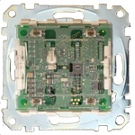

*To contribute to this page, edit the following
[file](https://github.com/Koenkk/zigbee2mqtt.io/blob/master/docs/devices/MEG5113-0300_MEG5165-0000.md)*

# Schneider Electric MEG5113-0300/MEG5165-0000

| Model | MEG5113-0300/MEG5165-0000  |
| Vendor  | Schneider Electric  |
| Description | Merten PlusLink Shutter insert with Merten Wiser System M Push Button |
| Supports | open,close,position,stop,linkquality |
| Picture |  |

## Notes


### Pairing
To get the device into pairing mode, press the up button 3 times briefly and then hold it for a long time (almost 20s). After about 10s the LED starts blinking slowly, continue to hold until it starts blinking rapidly. Now you can release it. Pairing will take a while to complete. The LED will blink and change color during this process.

### Control
The shutter control uses a simple timer to control the duration to open/close the shutter. Unfortunately the Zigbee command to set the timer is not known yet. Even if you set the timer via Bluetooth, it will be reset to the default 2 minutes every time you bring it back to Zigbee mode.
The consequence is, that if your shutter is faster than 2 minutes, the position information will not match with the shutter position (since the transition from 0% to 100% takes 120s).
Example: If your shutter motor needs 20 seconds to move from open to closed, it will already be closed at 1/6 of the time, i.e. at position 85. It will still take 120s for the position information to go from 100 down to 0.

If you use a shutter motor with positional switches, that stops at the Open or closed position, this will not be an issue. If you rely on the control to shut of the motor, the current implementation will keep the motor pulling until the timer has elapsed, that might not be a good idea.
If your shutter motor needs more than 2 minutes, I suppose it will stop before reaching the final position.

### Device type specific configuration
*[How to use device type specific configuration](../information/configuration.md)*

* `invert_cover`: By default the position/tilt values mean: open = 100, closed = 0. This can be inverted by setting this option to true (so open = 0, close = 100).


## Manual Home Assistant configuration
Although Home Assistant integration through [MQTT discovery](../integration/home_assistant) is preferred,
manual integration is possible with the following configuration:



```yaml
cover:
  - platform: "mqtt"
    availability_topic: "zigbee2mqtt/bridge/state"
    command_topic: "zigbee2mqtt/<FRIENDLY_NAME>/set"
    value_template: "{{ value_json.position }}"
    set_position_template: "{ \"position\": {{ position }} }"
    set_position_topic: "zigbee2mqtt/<FRIENDLY_NAME>/set"
    position_topic: "zigbee2mqtt/<FRIENDLY_NAME>"

sensor:
  - platform: "mqtt"
    state_topic: "zigbee2mqtt/<FRIENDLY_NAME>"
    availability_topic: "zigbee2mqtt/bridge/state"
    unit_of_measurement: "lqi"
    value_template: "{{ value_json.linkquality }}"
    icon: "mdi:signal"
```



