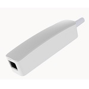

*To contribute to this page, edit the following
[file](https://github.com/Koenkk/zigbee2mqtt.io/blob/master/docs/devices/Meter_Reader.md)*

# Datek Eva HAN

| Model | Meter Reader  |
| Vendor  | Datek  |
| Description |AMS Meter Reader power-meter sensor |
| Exposes | power, energy, current, voltage, current_phase_b, voltage_phase_b, current_phase_c, voltage_phase_c, linkquality, temperature |
| Picture |  |

## Notes


### Pairing
Factory reset by removing the plastic cover and press & hold the power button for 10 seconds. The LED is then 
starting to blink Red/Blue to indicate in pairing mode.

### Should automatically support (only tested Kamstrup)
- Aidon
- Kaifa
- Kamstrup

### Configuring interface mode
There should be no need to configure into any interface mode as the Eva HAN should autodetect the correct mode.

### Not getting measurements
In case you are not getting any measurements, it could be that your firmware is too old. If firmware are < 0.4
either update fw via Eva Smart HUB or ask Datek for a replacement with min fw 0.4. Tested on 0.4.

### Where do I find this product
[Product page](https://shop.evasmart.no/produkt/smarthus/maleravleser#product-tabs1)


## Exposes

### Power (numeric)
Instantaneous measured power.
Value can be found in the published state on the `power` property.
It's not possible to read (`/get`) or write (`/set`) this value.
The unit of this value is `W`.

### Energy (numeric)
Sum of consumed energy.
Value can be found in the published state on the `energy` property.
It's not possible to read (`/get`) or write (`/set`) this value.
The unit of this value is `kWh`.

### Current (numeric)
Instantaneous measured electrical current.
Value can be found in the published state on the `current` property.
It's not possible to read (`/get`) or write (`/set`) this value.
The unit of this value is `A`.

### Voltage (numeric)
Measured electrical potential value.
Value can be found in the published state on the `voltage` property.
It's not possible to read (`/get`) or write (`/set`) this value.
The unit of this value is `V`.

### Current_phase_b (numeric)
Instantaneous measured electrical current on phase B.
Value can be found in the published state on the `current_phase_b` property.
It's not possible to read (`/get`) or write (`/set`) this value.
The unit of this value is `A`.

### Voltage_phase_b (numeric)
Measured electrical potential value on phase B.
Value can be found in the published state on the `voltage_phase_b` property.
It's not possible to read (`/get`) or write (`/set`) this value.
The unit of this value is `V`.

### Current_phase_c (numeric)
Instantaneous measured electrical current on phase C.
Value can be found in the published state on the `current_phase_c` property.
It's not possible to read (`/get`) or write (`/set`) this value.
The unit of this value is `A`.

### Voltage_phase_c (numeric)
Measured electrical potential value on phase C.
Value can be found in the published state on the `voltage_phase_c` property.
It's not possible to read (`/get`) or write (`/set`) this value.
The unit of this value is `V`.

### Linkquality (numeric)
Link quality (signal strength).
Value can be found in the published state on the `linkquality` property.
It's not possible to read (`/get`) or write (`/set`) this value.
The minimal value is `0` and the maximum value is `255`.
The unit of this value is `lqi`.

### Temperature (numeric)
Temperature in Celcius.
Value can be found in the published state on the `temperature` property.
It's not possible to read (`/get`) or write (`/set`) this value.
The unit of this value is `C`.

## Manual Home Assistant configuration
Although Home Assistant integration through [MQTT discovery](../integration/home_assistant) is preferred,
manual integration is possible with the following configuration:



```yaml
sensor:
  - platform: "mqtt"
    state_topic: "zigbee2mqtt/<FRIENDLY_NAME>"
    availability_topic: "zigbee2mqtt/bridge/state"
    value_template: "{{ value_json.power }}"
    unit_of_measurement: "W"
    device_class: "power"

sensor:
  - platform: "mqtt"
    state_topic: "zigbee2mqtt/<FRIENDLY_NAME>"
    availability_topic: "zigbee2mqtt/bridge/state"
    value_template: "{{ value_json.energy }}"
    unit_of_measurement: "kWh"
    device_class: "energy"

sensor:
  - platform: "mqtt"
    state_topic: "zigbee2mqtt/<FRIENDLY_NAME>"
    availability_topic: "zigbee2mqtt/bridge/state"
    value_template: "{{ value_json.current }}"
    unit_of_measurement: "A"
    device_class: "current"

sensor:
  - platform: "mqtt"
    state_topic: "zigbee2mqtt/<FRIENDLY_NAME>"
    availability_topic: "zigbee2mqtt/bridge/state"
    value_template: "{{ value_json.voltage }}"
    unit_of_measurement: "V"
    device_class: "voltage"

sensor:
  - platform: "mqtt"
    state_topic: "zigbee2mqtt/<FRIENDLY_NAME>"
    availability_topic: "zigbee2mqtt/bridge/state"
    value_template: "{{ value_json.current_phase_b }}"
    unit_of_measurement: "A"
    device_class: "current"

sensor:
  - platform: "mqtt"
    state_topic: "zigbee2mqtt/<FRIENDLY_NAME>"
    availability_topic: "zigbee2mqtt/bridge/state"
    value_template: "{{ value_json.voltage_phase_b }}"
    unit_of_measurement: "V"
    device_class: "voltage"

sensor:
  - platform: "mqtt"
    state_topic: "zigbee2mqtt/<FRIENDLY_NAME>"
    availability_topic: "zigbee2mqtt/bridge/state"
    value_template: "{{ value_json.current_phase_c }}"
    unit_of_measurement: "A"
    device_class: "current"

sensor:
  - platform: "mqtt"
    state_topic: "zigbee2mqtt/<FRIENDLY_NAME>"
    availability_topic: "zigbee2mqtt/bridge/state"
    value_template: "{{ value_json.voltage_phase_c }}"
    unit_of_measurement: "V"
    device_class: "voltage"

sensor:
  - platform: "mqtt"
    state_topic: "zigbee2mqtt/<FRIENDLY_NAME>"
    availability_topic: "zigbee2mqtt/bridge/state"
    value_template: "{{ value_json.linkquality }}"
    unit_of_measurement: "lqi"
    icon: "mdi:signal"

sensor:
  - platform: "mqtt"
    state_topic: "zigbee2mqtt/<FRIENDLY_NAME>"
    availability_topic: "zigbee2mqtt/bridge/state"
    value_template: "{{ value_json.temperature }}"
    unit_of_measurement: "℃"
    device_class: "temperature"
```



