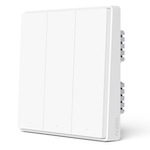

*To contribute to this page, edit the following
[file](https://github.com/Koenkk/zigbee2mqtt.io/blob/master/docs/devices/QBKG25LM.md)*

# Xiaomi QBKG25LM

| Model | QBKG25LM  |
| Vendor  | Xiaomi  |
| Description | Aqara D1 3 gang smart wall switch (no neutral wire) |
| Exposes | switch (state), power_outage_memory, action, linkquality |
| Picture |  |

## Notes


### Pairing
Press and hold the button on the device for +- 10 seconds
(until the blue light starts blinking and stops blinking), release and wait.

You may have to unpair the switch from an existing coordinator before the pairing process will start.

### Device type specific configuration
*[How to use device type specific configuration](../information/configuration.md)*

* `legacy`: Set to `false` to disable the legacy integration (highly recommended!) (default: true)


### Decoupled mode
Decoupled mode allows to turn wired switch into wireless button with separately controlled relay.
This might be useful to assign some custom actions to buttons and control relay remotely.
This command also allows to redefine which button controls which relay for the double switch (not supported for QBKG25LM).

Topic `zigbee2mqtt/FRIENDLY_NAME/system/set` should be used to modify operation mode.

**NOTE:** For QBKG25LM instead of `system` use `left`, `center` or `right` and leave out the `button` property in the payload.

Payload:
```js
{
  "operation_mode": {
    "button": "single"|"left"|"right", // Always use single for a single switch
    "state": "VALUE"
  }
}
```

Values                | Description
----------------------|---------------------------------------------------------
`control_relay`       | Button directly controls relay (for single switch and QBKG25LM)
`control_left_relay`  | Button directly controls left relay (for double switch, not supported for QBKG25LM)
`control_right_relay` | Button directly controls right relay (for double switch, not supported for QBKG25LM)
`decoupled`           | Button doesn't control any relay

`zigbee2mqtt/FRIENDLY_NAME/system/get` to read current mode.

Payload:
```js
{
  "operation_mode": {
    "button": "single"|"left"|"right" // Always use single for a single switch
  }
}
```

Response will be sent to `zigbee2mqtt/FRIENDLY_NAME`, example: `{"operation_mode_right":"control_right_relay"}`


### Power outage memory
This option allows the device to restore the last on/off state when it's reconnected to power.
To set this option publish to `zigbee2mqtt/FRIENDLY_NAME/set` payload `{"power_outage_memory": true}` (or `false`).
Now toggle the plug/switch once with the button on it, from now on it will restore its state when reconnecting to power.


### Do not disturb mode
This option allows to turn off the indicator lights between 21:00 and 09:00.
To set this option publish to `zigbee2mqtt/FRIENDLY_NAME/set` payload `{"do_not_disturb": true}` (or `false`).


## Exposes
### Switch (left endpoint)
The current state of this switch is in the published state under the `state_left` property (value is `ON` or `OFF`).
To control this switch publish a message to topic `zigbee2mqtt/FRIENDLY_NAME/set` with payload `{"state_left": "ON"}`, `{"state_left": "OFF"}` or `{"state_left": "TOGGLE"}`.
To read the current state of this switch publish a message to topic `zigbee2mqtt/FRIENDLY_NAME/get` with payload `{"state_left": ""}`.

### Power_outage_memory (binary)
Enable/disable the power outage memory, this recovers the on/off mode after power failure.
Value can be found in the published state on the `power_outage_memory` property.
It's not possible to read (`/get`) this value.
To write (`/set`) a value publish a message to topic `zigbee2mqtt/FRIENDLY_NAME/set` with payload `{"power_outage_memory": NEW_VALUE}`.
If value equals `true` power_outage_memory is ON, if `false` OFF.

### Switch (center endpoint)
The current state of this switch is in the published state under the `state_center` property (value is `ON` or `OFF`).
To control this switch publish a message to topic `zigbee2mqtt/FRIENDLY_NAME/set` with payload `{"state_center": "ON"}`, `{"state_center": "OFF"}` or `{"state_center": "TOGGLE"}`.
To read the current state of this switch publish a message to topic `zigbee2mqtt/FRIENDLY_NAME/get` with payload `{"state_center": ""}`.

### Switch (right endpoint)
The current state of this switch is in the published state under the `state_right` property (value is `ON` or `OFF`).
To control this switch publish a message to topic `zigbee2mqtt/FRIENDLY_NAME/set` with payload `{"state_right": "ON"}`, `{"state_right": "OFF"}` or `{"state_right": "TOGGLE"}`.
To read the current state of this switch publish a message to topic `zigbee2mqtt/FRIENDLY_NAME/get` with payload `{"state_right": ""}`.

### Action (enum)
Triggered action (e.g. a button click).
Value can be found in the published state on the `action` property.
It's not possible to read (`/get`) or write (`/set`) this value.
The possible values are: `left_single`, `left_double`, `left_triple`, `left_hold`, `left_release`, `center_single`, `center_double`, `center_triple`, `center_hold`, `center_release`, `right_single`, `right_double`, `right_triple`, `right_hold`, `right_release`.

### Linkquality (numeric)
Link quality (signal strength).
Value can be found in the published state on the `linkquality` property.
It's not possible to read (`/get`) or write (`/set`) this value.
The minimal value is `0` and the maximum value is `255`.
The unit of this value is `lqi`.

## Manual Home Assistant configuration
Although Home Assistant integration through [MQTT discovery](../integration/home_assistant) is preferred,
manual integration is possible with the following configuration:



```yaml
switch:
  - platform: "mqtt"
    state_topic: "zigbee2mqtt/<FRIENDLY_NAME>"
    availability_topic: "zigbee2mqtt/bridge/state"
    payload_off: "OFF"
    payload_on: "ON"
    value_template: "{{ value_json.state_left }}"
    command_topic: "zigbee2mqtt/<FRIENDLY_NAME>/left/set"

binary_sensor:
  - platform: "mqtt"
    state_topic: "zigbee2mqtt/<FRIENDLY_NAME>"
    availability_topic: "zigbee2mqtt/bridge/state"
    value_template: "{{ value_json.power_outage_memory }}"
    payload_on: true
    payload_off: false

switch:
  - platform: "mqtt"
    state_topic: "zigbee2mqtt/<FRIENDLY_NAME>"
    availability_topic: "zigbee2mqtt/bridge/state"
    payload_off: "OFF"
    payload_on: "ON"
    value_template: "{{ value_json.state_center }}"
    command_topic: "zigbee2mqtt/<FRIENDLY_NAME>/center/set"

switch:
  - platform: "mqtt"
    state_topic: "zigbee2mqtt/<FRIENDLY_NAME>"
    availability_topic: "zigbee2mqtt/bridge/state"
    payload_off: "OFF"
    payload_on: "ON"
    value_template: "{{ value_json.state_right }}"
    command_topic: "zigbee2mqtt/<FRIENDLY_NAME>/right/set"

sensor:
  - platform: "mqtt"
    state_topic: "zigbee2mqtt/<FRIENDLY_NAME>"
    availability_topic: "zigbee2mqtt/bridge/state"
    value_template: "{{ value_json.action }}"
    icon: "mdi:gesture-double-tap"

sensor:
  - platform: "mqtt"
    state_topic: "zigbee2mqtt/<FRIENDLY_NAME>"
    availability_topic: "zigbee2mqtt/bridge/state"
    unit_of_measurement: "lqi"
    value_template: "{{ value_json.linkquality }}"
    icon: "mdi:signal"
```



