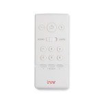

*To contribute to this page, edit the following
[file](https://github.com/Koenkk/zigbee2mqtt.io/blob/master/docs/devices/RC_110.md)*

# Innr RC 110

| Model | RC 110  |
| Vendor  | Innr  |
| Description | Remote Control |
| Exposes | state, brightness, action, linkquality |
| Picture |  |

## Notes

### Pairing

To enter pairing mode on the remote, press both `program` and `-` button. The LED on top
will flash slow, when in pairing mode and fast after joining a network.
To reset the remote, hold both `program` and `⏻`. After 10 seconds the LED will flash
slowly.
**After successful pairing, a group must be assigned to the remote manually.**
For doing so, look [here](../information/groups.md).

### Device type specific configuration
*[How to use device type specific configuration](../information/configuration.md)*

* `simulated_brightness`: When using in bridged mode, the device may use simulated
  brightness.
  * `interval`: An interval in milliseconds.
  * `delta`: Change after each interval.

## Exposes

### Action
Triggered scene.
Value can be found in the published state on the `action` property.
It's not possible to read (`/get`) or write (`/set`) this value.
Possible values are `scene_*`, for scenes 1 to 6 respectively.

### Light
One the of lights the remote can control. Supports the following features: `state_*`,
`brightness_*`.
It's not possible to read (`/get`) or write (`/set`) any of these values.
* `state_`*: The current state of a lamp with `{"state_<endpoint>": "ON"}` or
  `{"state_<endpoint>": "OFF"}`.
* `brightness_*`: The brightness of a lamp.
Value can be found in the published state on the `brightness_*` property.
  `{"brightness_<endpoint>": VALUE}` where `VALUE` is a number between `0` and `255`.
`<endpoint>` will be substituted with `main`, `l1`, `l2`, `l3`, `l4`, `l5` or `l6`
  for lights respectively.

### Battery (numeric)
Remaining battery in %.
Value can be found in the published state on the `battery` property.
It's not possible to read (`/get`) or write (`/set`) this value.
The minimal value is `0` and the maximum value is `100`.
The unit of this value is `%`.

### Linkquality (numeric)
Link quality (signal strength).
Value can be found in the published state on the `linkquality` property.
It's not possible to read (`/get`) or write (`/set`) this value.
The minimal value is `0` and the maximum value is `255`.
The unit of this value is `lqi`.

## Manual Home Assistant configuration
Although Home Assistant integration through [MQTT discovery](../integration/home_assistant) is preferred,
manual integration is possible with the following configuration:



```yaml
sensor:
  - platform: "mqtt"
    state_topic: "zigbee2mqtt/<FRIENDLY_NAME>"
    availability_topic: "zigbee2mqtt/bridge/state"
    value_template: "{{ value_json.state_main }}"

sensor:
  - platform: "mqtt"
    state_topic: "zigbee2mqtt/<FRIENDLY_NAME>"
    availability_topic: "zigbee2mqtt/bridge/state"
    value_template: "{{ value_json.state_l1 }}"

sensor:
  - platform: "mqtt"
    state_topic: "zigbee2mqtt/<FRIENDLY_NAME>"
    availability_topic: "zigbee2mqtt/bridge/state"
    value_template: "{{ value_json.state_l2 }}"

sensor:
  - platform: "mqtt"
    state_topic: "zigbee2mqtt/<FRIENDLY_NAME>"
    availability_topic: "zigbee2mqtt/bridge/state"
    value_template: "{{ value_json.state_l3 }}"

sensor:
  - platform: "mqtt"
    state_topic: "zigbee2mqtt/<FRIENDLY_NAME>"
    availability_topic: "zigbee2mqtt/bridge/state"
    value_template: "{{ value_json.state_l4 }}"

sensor:
  - platform: "mqtt"
    state_topic: "zigbee2mqtt/<FRIENDLY_NAME>"
    availability_topic: "zigbee2mqtt/bridge/state"
    value_template: "{{ value_json.state_l5 }}"

sensor:
  - platform: "mqtt"
    state_topic: "zigbee2mqtt/<FRIENDLY_NAME>"
    availability_topic: "zigbee2mqtt/bridge/state"
    value_template: "{{ value_json.state_l6 }}"

sensor:
  - platform: "mqtt"
    state_topic: "zigbee2mqtt/<FRIENDLY_NAME>"
    availability_topic: "zigbee2mqtt/bridge/state"
    unit_of_measurement: "%"
    value_template: "{{ value_json.battery }}"
    device_class: "battery"

sensor:
  - platform: "mqtt"
    state_topic: "zigbee2mqtt/<FRIENDLY_NAME>"
    availability_topic: "zigbee2mqtt/bridge/state"
    value_template: "{{ value_json.action }}"

sensor:
  - platform: "mqtt"
    state_topic: "zigbee2mqtt/<FRIENDLY_NAME>"
    availability_topic: "zigbee2mqtt/bridge/state"
    unit_of_measurement: "lqi"
    value_template: "{{ value_json.linkquality }}"
    icon: "mdi:signal"
```



