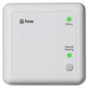

*To contribute to this page, edit the following
[file](https://github.com/Koenkk/zigbee2mqtt.io/blob/master/docs/devices/SLR1.md)*

# Hive SLR1

| Model | SLR1  |
| Vendor  | Hive  |
| Description | Heating thermostat |
| Exposes | climate (occupied_heating_setpoint, local_temperature, system_mode, running_state), temperature_setpoint_hold, temperature_setpoint_hold_duration, linkquality |
| Picture |  |

## Notes

None


## Exposes

### Climate 
This climate device supports the following features: `occupied_heating_setpoint`, `local_temperature`, `system_mode`, `running_state`.
- `occupied_heating_setpoint`: Temperature setpoint. To control publish a message to topic `zigbee2mqtt/FRIENDLY_NAME/set` with payload `{"occupied_heating_setpoint": VALUE}` where `VALUE` is the °C between `5` and `32`. To read send a message to `zigbee2mqtt/FRIENDLY_NAME/get` with payload `{"occupied_heating_setpoint": ""}`.
- `local_temperature`: Current temperature measured on the device (in °C). To read send a message to `zigbee2mqtt/FRIENDLY_NAME/get` with payload `{"local_temperature": ""}`.
- `system_mode`: Mode of this device. To control publish a message to topic `zigbee2mqtt/FRIENDLY_NAME/set` with payload `{"system_mode": VALUE}` where `VALUE` is one of: `off`, `auto`, `heat`. To read send a message to `zigbee2mqtt/FRIENDLY_NAME/get` with payload `{"system_mode": ""}`.
- `running_state`: The current running state. Possible values are: `idle`, `heat`. To read send a message to `zigbee2mqtt/FRIENDLY_NAME/get` with payload `{"running_state": ""}`.

### Temperature_setpoint_hold (binary)
Prevent changes. `false` = run normally. `true` = prevent from making changes. Must be set to `false` when system_mode = off or `true` for heat.
Value can be found in the published state on the `temperature_setpoint_hold` property.
To read (`/get`) the value publish a message to topic `zigbee2mqtt/FRIENDLY_NAME/get` with payload `{"temperature_setpoint_hold": ""}`.
To write (`/set`) a value publish a message to topic `zigbee2mqtt/FRIENDLY_NAME/set` with payload `{"temperature_setpoint_hold": NEW_VALUE}`.
If value equals `true` temperature_setpoint_hold is ON, if `false` OFF.

### Temperature_setpoint_hold_duration (numeric)
Period in minutes for which the setpoint hold will be active. 65535 = attribute not used. 0 to 360 to match the remote display.
Value can be found in the published state on the `temperature_setpoint_hold_duration` property.
To read (`/get`) the value publish a message to topic `zigbee2mqtt/FRIENDLY_NAME/get` with payload `{"temperature_setpoint_hold_duration": ""}`.
To write (`/set`) a value publish a message to topic `zigbee2mqtt/FRIENDLY_NAME/set` with payload `{"temperature_setpoint_hold_duration": NEW_VALUE}`.
The minimal value is `0` and the maximum value is `65535`.

### Linkquality (numeric)
Link quality (signal strength).
Value can be found in the published state on the `linkquality` property.
It's not possible to read (`/get`) or write (`/set`) this value.
The minimal value is `0` and the maximum value is `255`.
The unit of this value is `lqi`.

## Manual Home Assistant configuration
Although Home Assistant integration through [MQTT discovery](../integration/home_assistant) is preferred,
manual integration is possible with the following configuration:



```yaml
climate:
  - platform: "mqtt"
    availability_topic: "zigbee2mqtt/bridge/state"
    temperature_unit: "C"
    temp_step: 0.5
    min_temp: "5"
    max_temp: "32"
    current_temperature_topic: true
    current_temperature_template: "{{ value_json.local_temperature }}"
    mode_state_topic: true
    mode_state_template: "{{ value_json.system_mode }}"
    modes: 
      - "off"
      - "auto"
      - "heat"
    mode_command_topic: true
    action_topic: true
    action_template: "{{ values[value_json.running_state] }}"
    temperature_command_topic: "occupied_heating_setpoint"
    temperature_state_template: "{{ value_json.occupied_heating_setpoint }}"
    temperature_state_topic: true

switch:
  - platform: "mqtt"
    state_topic: "zigbee2mqtt/<FRIENDLY_NAME>"
    availability_topic: "zigbee2mqtt/bridge/state"
    value_template: " true  false "
    payload_on: "true"
    payload_off: "false"
    command_topic: "zigbee2mqtt/<FRIENDLY_NAME>/set"
    command_topic_postfix: "temperature_setpoint_hold"

sensor:
  - platform: "mqtt"
    state_topic: "zigbee2mqtt/<FRIENDLY_NAME>"
    availability_topic: "zigbee2mqtt/bridge/state"
    value_template: "{{ value_json.temperature_setpoint_hold_duration }}"

sensor:
  - platform: "mqtt"
    state_topic: "zigbee2mqtt/<FRIENDLY_NAME>"
    availability_topic: "zigbee2mqtt/bridge/state"
    value_template: "{{ value_json.linkquality }}"
    unit_of_measurement: "lqi"
    enabled_by_default: false
    icon: "mdi:signal"
    state_class: "measurement"
```



