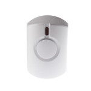

*To contribute to this page, edit the following
[file](https://github.com/Koenkk/zigbee2mqtt.io/blob/master/docs/devices/SRAC-23B-ZBSR.md)*

# Climax SRAC-23B-ZBSR

| Model | SRAC-23B-ZBSR  |
| Vendor  | Climax  |
| Description | Smart siren |
| Exposes | warning, max_duration, alarm, battery_low, tamper, battery, linkquality |
| Picture |  |

## Notes

### Warning usage
Warning only support a single mode, `burglar`

Duration of using `warning` can be shorter than `max_duration` but not longer. If `max_duration` are set to 60 seconds, and you try to set `warning` with `duration` of 90 seconds, the warning will only apply for 60 seconds. Default value of `max_duration` are 300 seconds

This device do not support the `strobe_duty_cycle` functionality


### Triggering alarm, Advanced
This siren can be triggered manually by publishing to `zigbee2mqtt/FRIENDLY_NAME/set` with the payloads:

To start :
* `{"warning":{"duration":60,"level":"low","mode":"burglar","strobe":false,"strobe_duty_cycle":0}}`
Where:
- `duration`: the number of seconds the alarm will be on
- `level`: `low`, `medium`, `high`, `very_high`
- `mode`: `stop`, `burglar`
- `strobe`: `true`, `false`
- `strobe_duty_cycle`: not supported

To stop:
* `{"warning":{"duration":60,"level":"low","mode":"stop","strobe":false,"strobe_duty_cycle":0}}`

### Triggering alarm, Simple
Can be set by publishing to `zigbee2mqtt/FRIENDLY_NAME/set` with payload `{"alarm": "START"}` and `{"alarm": "OFF"}`
Set `max_duration` from the Zigbee2MQTT UI or by publishing `{"max_duration": NEW_VALUE}`
This alarm are preset to highest volume


## Exposes

### Warning (composite)
Can be set by publishing to `zigbee2mqtt/FRIENDLY_NAME/set` with payload `{"warning": {"mode": VALUE, "level": VALUE, "strobe": VALUE, "duration": VALUE}}`
- `mode` (enum): Mode of the warning (sound effect). Allowed values: `stop` and `burglar`
- `level` (enum): Sound level. Allowed values: `low`, `medium`, `high`, `very_high`
- `strobe` (binary): Turn on/off the strobe (light) during warning. Allowed values: `true` or `false`
- `duration` (numeric): Duration in seconds of the alarm. 

### Alarm (binary)
Can be set by publishing to `zigbee2mqtt/FRIENDLY_NAME/set` with payload `{"alarm": "START"}` and `{"alarm": "OFF"}`
Set `max_duration` from the Zigbee2MQTT UI

### Max_duration (numeric)
Set the maximum duration of the siren. Cannot be overridden by `duration` in `warning`

### Battery_low (binary)
Indicates if the battery of this device is almost empty.
Value can be found in the published state on the `battery_low` property.
It's not possible to read (`/get`) or write (`/set`) this value.
If value equals `true` battery_low is ON, if `false` OFF.

### Tamper (binary)
Indicates whether the device is tampered.
Value can be found in the published state on the `tamper` property.
It's not possible to read (`/get`) or write (`/set`) this value.
If value equals `true` tamper is ON, if `false` OFF.

### Battery (numeric)
Remaining battery in %.
Value can be found in the published state on the `battery` property.
It's not possible to read (`/get`) or write (`/set`) this value.
The minimal value is `0` and the maximum value is `100`.
The unit of this value is `%`.

### Linkquality (numeric)
Link quality (signal strength).
Value can be found in the published state on the `linkquality` property.
It's not possible to read (`/get`) or write (`/set`) this value.
The minimal value is `0` and the maximum value is `255`.
The unit of this value is `lqi`.

## Manual Home Assistant configuration
Although Home Assistant integration through [MQTT discovery](../integration/home_assistant) is preferred,
manual integration is possible with the following configuration:



```yaml
binary_sensor:
  - platform: "mqtt"
    state_topic: "zigbee2mqtt/<FRIENDLY_NAME>"
    availability_topic: "zigbee2mqtt/bridge/state"
    value_template: "{{ value_json.battery_low }}"
    payload_on: true
    payload_off: false
    device_class: "battery"

binary_sensor:
  - platform: "mqtt"
    state_topic: "zigbee2mqtt/<FRIENDLY_NAME>"
    availability_topic: "zigbee2mqtt/bridge/state"
    value_template: "{{ value_json.tamper }}"
    payload_on: true
    payload_off: false

sensor:
  - platform: "mqtt"
    state_topic: "zigbee2mqtt/<FRIENDLY_NAME>"
    availability_topic: "zigbee2mqtt/bridge/state"
    value_template: "{{ value_json.battery }}"
    unit_of_measurement: "%"
    device_class: "battery"
    state_class: "measurement"

sensor:
  - platform: "mqtt"
    state_topic: "zigbee2mqtt/<FRIENDLY_NAME>"
    availability_topic: "zigbee2mqtt/bridge/state"
    value_template: "{{ value_json.linkquality }}"
    unit_of_measurement: "lqi"
    enabled_by_default: false
    icon: "mdi:signal"
    state_class: "measurement"
```



