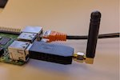
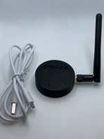
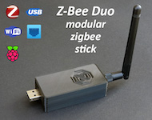
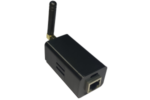
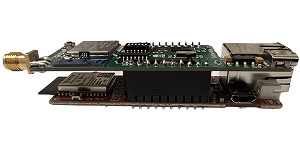
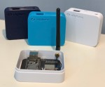
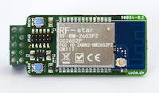
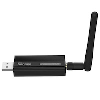
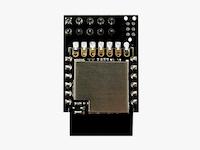
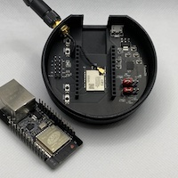

# Supported Adapters

All officially supported adapters are listed on this page. Note that before an adapter can be used with Zigbee2MQTT it has to be flashed with a coordinator firmware (some adapters come preflashed).

::: tip TIP
Want to migrate to a different adapter? Read [this](../faq/README.md#how-do-i-migrate-from-one-adapter-to-another)
:::

## Recommended
The adapters below are recommended because they use powerful chips, can handle large networks and are well-supported.

### Based on Texas Instruments CC2652/CC1352 chip
_(in order of first appearance)_

* USB connected (easiest)
  * <details>
    <summary>Electrolama zig-a-zig-ah! (zzh!)</summary>
      
    USB connected adapter with external antenna based on CC2652R chip  
    * [Coordinator firmware](https://github.com/Koenkk/Z-Stack-firmware/raw/master/coordinator/Z-Stack_3.x.0/bin/CC2652R_coordinator_20220219.zip)  
    * [Router firmware](https://github.com/Koenkk/Z-Stack-firmware/raw/master/router/Z-Stack_3.x.0/bin/CC2652R_router_20220125.zip)  
    * [Flashing instructions](https://electrolama.com/radio-docs/#step-3-flash-the-firmware-on-your-stick) or see "Flashing CC1352/CC2652/CC2538 based adapters" below
    * [Buy](https://shop.electrolama.com/collections/usb-rf-sticks/products/zzh-multiprotocol-rf-stick)
  
    
    </details>  

  * <details>
    <summary>Slaesh's CC2652RB stick</summary>

    **WARNING:** Problems with customer support have been [reported](https://github.com/Koenkk/zigbee2mqtt/discussions/6702).
  
    USB connected adapter with external antenna based on CC2652RB chip  
    * [Coordinator firmware](https://github.com/Koenkk/Z-Stack-firmware/raw/master/coordinator/Z-Stack_3.x.0/bin/CC2652RB_coordinator_20220219.zip)  
    * [Router firmware](https://github.com/Koenkk/Z-Stack-firmware/raw/master/router/Z-Stack_3.x.0/bin/CC2652RB_router_20220125.zip)  
    * [Flashing instructions](https://slae.sh/projects/cc2652/#flashing) or see "Flashing CC1352/CC2652/CC2538 based adapters" below
    * [Buy](https://slae.sh/projects/cc2652/)
  
    
    </details>

  * <details>
    <summary>Tube's CC2652P2 USB Coordinator</summary>
  
    Open source hardware CC2652P based USB connected adapter with external antenna and USB extension cable  
    * [Coordinator firmware](https://github.com/Koenkk/Z-Stack-firmware/raw/master/coordinator/Z-Stack_3.x.0/bin/CC1352P2_CC2652P_launchpad_coordinator_20220219.zip)  
    * [Router firmware](https://github.com/Koenkk/Z-Stack-firmware/raw/master/router/Z-Stack_3.x.0/bin/CC1352P2_CC2652P_launchpad_router_20220125.zip)  
    * [Flashing instructions](https://github.com/tube0013/tube_gateways) or see "Flashing CC1352/CC2652/CC2538 based adapters" below
    * [Buy](https://www.tubeszb.com/)
  
    
    </details>
  
  * <details>
    <summary>Egony Stick V4</summary>
  
    Powerful CC2652P Zigbee USB dongle and Raspberry Pi GPIO module. Available in Ebyte (left picture) and RFSTAR (right picture) version.  
    * Coordinator firmware: [Ebyte](https://github.com/Koenkk/Z-Stack-firmware/raw/master/coordinator/Z-Stack_3.x.0/bin/CC1352P2_CC2652P_other_coordinator_20220219.zip) [RFSTAR](https://github.com/Koenkk/Z-Stack-firmware/raw/master/coordinator/Z-Stack_3.x.0/bin/CC1352P2_CC2652P_launchpad_coordinator_20220219.zip)  
    * Router firmware: [Ebyte](https://github.com/Koenkk/Z-Stack-firmware/raw/master/router/Z-Stack_3.x.0/bin/CC1352P2_CC2652P_other_router_20220125.zip) [RFSTAR](https://github.com/Koenkk/Z-Stack-firmware/raw/master/router/Z-Stack_3.x.0/bin/CC1352P2_CC2652P_launchpad_router_20220125.zip)  
    * [Flashing instructions](https://github.com/egony/cc2652p_E72-2G4M20S1E/wiki/Flashing-EN) or see "Flashing CC1352/CC2652/CC2538 based adapters" below
    * Description: [Ebyte](https://github.com/egony/cc2652p_E72-2G4M20S1E/wiki/Home-EN) [RFSTAR](https://github.com/egony/cc2652p_cc1352p_RF-STAR/wiki/Home-EN)  
    * [Contact](http://t.me/Egony)
  
     
    </details>

  * <details>
    <summary>ZigStar Stick v4</summary>
  
    Powerfull Open source dongle with external antenna based on CC2652P  
    * [Coordinator firmware](https://github.com/Koenkk/Z-Stack-firmware/raw/master/coordinator/Z-Stack_3.x.0/bin/CC1352P2_CC2652P_launchpad_coordinator_20220219.zip)  
    * [Router firmware](https://github.com/Koenkk/Z-Stack-firmware/raw/master/router/Z-Stack_3.x.0/bin/CC1352P2_CC2652P_launchpad_router_20220125.zip)  
    * [Description](https://zig-star.com/projects/zigbee-stick-v4/)  
    * [Flashing instructions](https://zig-star.com/radio-docs/flash-cc-bsl/) or see "Flashing CC1352/CC2652/CC2538 based adapters" below
    * [Buy](https://zig-star.com)
  
    
    </details>

  * <details>
    <summary>CircuitSetup's CC2652P2 USB Coordinator</summary>
  
    CC2652P based USB connected adapter pre-programmed with Z-Stack  
    * [Coordinator firmware](https://github.com/Koenkk/Z-Stack-firmware/raw/master/coordinator/Z-Stack_3.x.0/bin/CC1352P2_CC2652P_launchpad_coordinator_20220219.zip)  
    * [Router firmware](https://github.com/Koenkk/Z-Stack-firmware/raw/master/router/Z-Stack_3.x.0/bin/CC1352P2_CC2652P_launchpad_router_20220125.zip)  
    * [Flashing instructions](https://circuitsetup.us/product/usb-zigbee-stick-z-stack-coordinator/) or see "Flashing CC1352/CC2652/CC2538 based adapters" below
    * [Buy](https://circuitsetup.us/product/usb-zigbee-stick-z-stack-coordinator/)
  
    
    </details>

  * <details>
    <summary>SMLIGHT CC2652P Zigbee USB Adapter SLZB-02</summary>
  
    CC2652P factory-made Zigbee USB coordinator with external 6dB antenna and worldwide delivery  
    * [Coordinator firmware](https://github.com/Koenkk/Z-Stack-firmware/raw/master/coordinator/Z-Stack_3.x.0/bin/CC1352P2_CC2652P_other_coordinator_20220219.zip)  
    * [Router firmware](https://github.com/Koenkk/Z-Stack-firmware/raw/master/router/Z-Stack_3.x.0/bin/CC1352P2_CC2652P_other_router_20220125.zip)  
    * [Description](https://smartlight.me/smart-home-devices/zigbee-devices/zigbee-coordinator-v4-cc2652p)  
    * [Flashing instructions](https://smartlight.me/flashing_slzb-02) or see "Flashing CC1352/CC2652/CC2538 based adapters" below
    * Buy: [eBay](https://www.ebay.com/itm/164928826521) [Official store](https://smartlight.me/smart-home-devices/zigbee-devices/zigbee-coordinator-v4-cc2652p) [Telegram](https://t.me/smartlightme)
  
    
    </details>

  * <details>
    <summary>SONOFF Zigbee 3.0 USB Dongle Plus ZBDongle-P</summary>
  
    CC2652P based USB connected adapter pre-programmed and with enclosure.

    Note before buying that ITead slightly confusingly now sells both the "ZBDongle-E" (based on EFR32MG21) and "ZBDongle-P" (based on CC2652P).
    This section is about the "ZBDongle-P", for "ZBDongle-E" see below.

    * [Coordinator firmware](https://github.com/Koenkk/Z-Stack-firmware/raw/master/coordinator/Z-Stack_3.x.0/bin/CC1352P2_CC2652P_launchpad_coordinator_20220219.zip)  
    * [Router firmware](https://github.com/Koenkk/Z-Stack-firmware/raw/master/router/Z-Stack_3.x.0/bin/CC1352P2_CC2652P_launchpad_router_20220125.zip)  
    * [Flashing instructions](https://sonoff.tech/wp-content/uploads/2021/09/Zigbee-3.0-USB-dongle-plus-firmware-flashing-1-1.docx) ([PDF version](https://github.com/Koenkk/zigbee2mqtt.io/raw/master/docs/guide/adapters/flashing/zigbee-3.0-usb-dongle-plus-firmware_flashing-1-1.pdf)) or see "Flashing CC1352/CC2652/CC2538 based adapters" below  
    * [Buy](https://itead.cc/product/sonoff-zigbee-3-0-usb-dongle-plus/)
  
    
    </details>

  * <details>
    <summary>Vision CC2652 dongle</summary>
  
    Adapter or small development board based on CC2652R (VS201) or CC2652P (VS202)  
    Coordinator firmware: [VS201](https://github.com/Koenkk/Z-Stack-firmware/raw/master/coordinator/Z-Stack_3.x.0/bin/CC2652R_coordinator_20220219.zip) [VS202](https://github.com/Koenkk/Z-Stack-firmware/raw/master/coordinator/Z-Stack_3.x.0/bin/CC1352P2_CC2652P_launchpad_coordinator_20220219.zip)  
    Router firmware: [VS201](https://github.com/Koenkk/Z-Stack-firmware/raw/master/router/Z-Stack_3.x.0/bin/CC2652R_router_20220125.zip) [VS202](https://github.com/Koenkk/Z-Stack-firmware/raw/master/router/Z-Stack_3.x.0/bin/CC1352P2_CC2652P_launchpad_router_20220125.zip)  
    * [Flashing instructions](https://www.aliexpress.com/item/1005002823262979.html?spm=a2g0o.productlist.0.0.1a1640b82yeViq&algo_pvid=e01b1872-ca85-4814-971f-ce9b058855b8&algo_exp_id=e01b1872-ca85-4814-971f-ce9b058855b8-0&pdp_ext_f=%7B%22sku_id%22%3A%2212000022351543786%22%7D) or see "Flashing CC1352/CC2652/CC2538 based adapters" below
    * Buy: [VS201](https://www.aliexpress.com/item/1005002809329614.html) [VS202](https://www.aliexpress.com/item/1005003393047763.html)
  
    
    </details>


* Hybrid (network + USB)
  * <details>
    <summary>Gio-dot Z-Bee Duo with CC2652P</summary>
  
    4 in 1 zigbee adapter: USB Stick, WiFi, LAN, PI Zero Hat, with external antenna and 3D printed case. 
    * [Description](https://gio-dot.github.io/Z-Bee-Duo/)  
    * [Coordinator firmware](https://github.com/Koenkk/Z-Stack-firmware/blob/master/coordinator/Z-Stack_3.x.0/bin/CC1352P2_CC2652P_other_coordinator_20220219.zip)  
    * [Router firmware](https://github.com/Koenkk/Z-Stack-firmware/blob/master/router/Z-Stack_3.x.0/bin/CC1352P2_CC2652P_other_router_20220125.zip)  
    * [Flashing instructions](https://gio-dot.github.io/Z-Bee-Duo/Firmware-upgrade) or see "Flashing CC1352/CC2652/CC2538 based adapters" below
    * [Buy](https://www.tindie.com/products/gio_dot/z-bee-duo-modular-cc2652p-zigbee-30-adapter/)
  
    
    </details>

  * <details>
    <summary>ZigStar LAN Coordinator</summary>
  
    Powerfull Open source LAN Coordinator with external antenna on CC2652P  
    * [Coordinator firmware](https://github.com/Koenkk/Z-Stack-firmware/raw/master/coordinator/Z-Stack_3.x.0/bin/CC1352P2_CC2652P_launchpad_coordinator_20220219.zip)  
    * [Router firmware](https://github.com/Koenkk/Z-Stack-firmware/raw/master/router/Z-Stack_3.x.0/bin/CC1352P2_CC2652P_launchpad_router_20220125.zip)  
    * [Description](https://zig-star.com/projects/zigbee-gw-lan/)  
    * [Flashing instructions](https://zig-star.com/radio-docs/flash-cc-bsl/) or see "Flashing CC1352/CC2652/CC2538 based adapters" below
    * [Buy](https://zig-star.com) [Tindie](https://www.tindie.com/products/zigstar/zigstar-lan-gateway/)
  
    
    </details>
	
  * <details>
    <summary>ZigStar PoE Coordinator</summary>
  
    Open source PoE af Coordinator with external antenna on CC2652P  
    * [Coordinator firmware](https://github.com/Koenkk/Z-Stack-firmware/raw/master/coordinator/Z-Stack_3.x.0/bin/CC1352P2_CC2652P_launchpad_coordinator_20220219.zip)  
    * [Router firmware](https://github.com/Koenkk/Z-Stack-firmware/raw/master/router/Z-Stack_3.x.0/bin/CC1352P2_CC2652P_launchpad_router_20220125.zip)  
    * [Description](https://zig-star.com/projects/zigstar-lilyzig/)  
    * [Flashing instructions](https://zig-star.com/radio-docs/zigstar-multi-tool/) or see "Flashing CC1352/CC2652/CC2538 based adapters" below
    * [Buy](https://zig-star.com) [Tindie](https://www.tindie.com/products/zigstar/zigstar-lilyzig-poe/) 
  
    
    </details>
    
  * <details>
    <summary>SMLIGHT SLZB-06 Zigbee ethernet USB POE WiFi LAN adapter</summary>
  
    Powerfull, tiny modern design, developed for Zigbee2MQTT, PoE supported, pre-flashed and ready to use Zigbee adapter. Supports Zigbee 3.0, Ethernet, LAN, USB and WiFi connections. Rich packing that includes SLZB-06 adapter, +5dB antenna, screws, adhesive tapes, scredriver, microUSB-typeC adapter, screw-fix-helper and QR-manual. Distant update, modern UI open-source firmware. Optoelectronic isolation for Ethernet, LEDs and physical button for interacting with user. Fits home and business use.
    * [Coordinator firmware (CC2652P)](https://github.com/Koenkk/Z-Stack-firmware/raw/master/coordinator/Z-Stack_3.x.0/bin/CC1352P2_CC2652P_other_coordinator_20220219.zip)  
    * [ESP32 firmware](https://github.com/smlight-dev/slzb-06-firmware/)  
    * [Product site](https://smlight.tech/product/slzb-06/)
    * [Manual](https://smlight.tech/manual/slzb-06/)
    * Buy: [eBay](https://www.ebay.com/itm/165744749577), [official store](https://smartlight.me/smart-home-devices/zigbee-devices/smlight-slzb-06en) 

    
    </details>


* Network
  * <details>
    <summary>Tube's Zigbee Gateways (CC2652P2 variant)</summary>
  
    Open source hardware CC2652P and ESP32 based Zigbee to Ethernet Coordinator (left picture), POE variant is also available (right picture)  
    * [Coordinator firmware](https://github.com/Koenkk/Z-Stack-firmware/raw/master/coordinator/Z-Stack_3.x.0/bin/CC1352P2_CC2652P_launchpad_coordinator_20220219.zip)  
    * [Router firmware](https://github.com/Koenkk/Z-Stack-firmware/raw/master/router/Z-Stack_3.x.0/bin/CC1352P2_CC2652P_launchpad_router_20220125.zip)  
    * [Flashing instructions](https://github.com/tube0013/tube_gateways) or see "Flashing CC1352/CC2652/CC2538 based adapters" below
    * [Buy](https://www.tubeszb.com/)
  
     
    </details>

  * <details>
    <summary>cyijun OpenZ3Gateway</summary>
  
    An open source Zstack3 gateway powered by ESP8266 and CC2652P modules. One costs less than 60 CNY in China.  
    * [Coordinator firmware](https://github.com/Koenkk/Z-Stack-firmware/raw/master/coordinator/Z-Stack_3.x.0/bin/CC1352P2_CC2652P_launchpad_coordinator_20220219.zip)  
    * [Router firmware](https://github.com/Koenkk/Z-Stack-firmware/raw/master/router/Z-Stack_3.x.0/bin/CC1352P2_CC2652P_launchpad_router_20220125.zip)
    * Flashing instructions; see "Flashing CC1352/CC2652/CC2538 based adapters" below
    * [Description](https://github.com/cyijun/OpenZ3Gateway)  
    * [Tindie](https://www.tindie.com/products/cyijun/openz3gateway/)  
  
    
    </details>
  * <details>
    <summary>XGG 52PZ2MGateway</summary>
  
    An open source Zstack3 gateway powered by ESP8266 and CC2652P modules. One costs less than 60 CNY in China.  
    * [Coordinator firmware](https://github.com/Koenkk/Z-Stack-firmware/raw/master/coordinator/Z-Stack_3.x.0/bin/CC1352P2_CC2652P_launchpad_coordinator_20220219.zip)  
    * [Router firmware](https://github.com/Koenkk/Z-Stack-firmware/raw/master/router/Z-Stack_3.x.0/bin/CC1352P2_CC2652P_launchpad_router_20220125.zip)  
    * Flashing instructions; see "Flashing CC1352/CC2652/CC2538 based adapters" below
    * [Description](https://z2m.wiki/)  
    * [Buy](https://z2m.wiki/)  
  
    
    </details>
  * <details>
    <summary>SMLIGHT Zigbee LAN Adapter CC2652P Model SLZB-05</summary>
  
    Pre-flashed ready-to-use Zigbee LAN CC2652P Adapter, factory made, metal case, 6dB antenna, worldwide delivery, Zigbee firmware can be manually updated via USB in 5 easy steps, customer/tech support, fast order processing.  
    * [Coordinator firmware](https://github.com/Koenkk/Z-Stack-firmware/raw/master/coordinator/Z-Stack_3.x.0/bin/CC1352P2_CC2652P_other_coordinator_20220219.zip)  
    * [Router firmware](https://github.com/Koenkk/Z-Stack-firmware/raw/master/router/Z-Stack_3.x.0/bin/CC1352P2_CC2652P_other_router_20220125.zip)  
    * [Description](https://smartlight.me/smart-home-devices/zigbee-devices/smlight-zigbee-lan-adapter-slzb-05en)  
    * Flashing instructions; see "Flashing CC1352/CC2652/CC2538 based adapters" below
    * Buy: [eBay](https://www.ebay.com/itm/165178757770) [Official store](https://smartlight.me/smart-home-devices/zigbee-devices/smlight-zigbee-lan-adapter-slzb-05en) [Telegram](https://t.me/smartlightme)

    
    </details>
  * <details>
    <summary>cod.m ZigBee CC2652P2 TCP Coordinator</summary>

    CC2652P2 ZigBee Ethernet Coordinator, ethernet part based on [USR-K6](https://www.pusr.com/products/low-cost-ttl-to-ethernet-modules-usr-k6.html) module. POE possible with external splitter. Comes complete with 3d printed case and antenna.
    * [Coordinator firmware](https://github.com/Koenkk/Z-Stack-firmware/raw/master/coordinator/Z-Stack_3.x.0/bin/CC1352P2_CC2652P_launchpad_coordinator_20220219.zip)
    * [Router firmware](https://github.com/Koenkk/Z-Stack-firmware/raw/master/router/Z-Stack_3.x.0/bin/CC1352P2_CC2652P_launchpad_router_20220125.zip)
    * [Flashing instructions](https://github.com/codm/cc2652p2-tcp-zigbee#update)
    * [Buy](https://shop.codm.de/automation/zigbee/40/zigbee-cc2652p2-tcp-ethernet-coordinator)

     
    </details>
* Raspberry Pi hat
  * <details>
    <summary>cod.m Zigbee CC2652P RPi Module</summary>
  
    Raspberry Pi GPIO module with CC2652P and integrated power amplifier (+20dBm)  
    * [Coordinator firmware](https://github.com/Koenkk/Z-Stack-firmware/raw/master/coordinator/Z-Stack_3.x.0/bin/CC1352P2_CC2652P_launchpad_coordinator_20220219.zip)  
    * [Router firmware](https://github.com/Koenkk/Z-Stack-firmware/raw/master/router/Z-Stack_3.x.0/bin/CC1352P2_CC2652P_launchpad_router_20220125.zip)  
    * [Flashing instructions](https://github.com/codm/cc2652-raspberry-pi-module#firmware) or see "Flashing CC1352/CC2652/CC2538 based adapters" below
    * [Buy](https://shop.codm.de/automation/zigbee/33/zigbee-cc2652p2-raspberry-pi-module)
  
    
    </details>
  * <details>
    <summary>ZigStar Shield</summary>
  
    Powerfull Open source Pi Shield based on CC2652P  
    * [Coordinator firmware](https://github.com/Koenkk/Z-Stack-firmware/raw/master/coordinator/Z-Stack_3.x.0/bin/CC1352P2_CC2652P_launchpad_coordinator_20220219.zip)  
    * [Router firmware](https://github.com/Koenkk/Z-Stack-firmware/raw/master/router/Z-Stack_3.x.0/bin/CC1352P2_CC2652P_launchpad_router_20220125.zip)  
    * [Description](https://zig-star.com/projects/zigbee-shield/)  
    * [Flashing instructions](https://zig-star.com/radio-docs/flash-cc-bsl/) or see "Flashing CC1352/CC2652/CC2538 based adapters" below  
    * [Buy](https://zig-star.com)
  
    
    </details>

* Development board
  * <details>
    <summary>Texas Instruments LAUNCHXL-CC1352P-2</summary>
  
    USB connected development kit, based on CC1352P chip  
    These devices have two serial devices built in. Make sure you put the right serial device in the [configuration](../configuration/) or use auto detect (completely remove the `serial` section from `configuration.yaml`) if you only have one Texas Instruments CC device connected to your system.  
    An external antenna can be connected which could increase range: [requires resoldering a tiny capacitor (moving C14 to C24)](http://e2e.ti.com/support/wireless-connectivity/zigbee-and-thread/f/158/t/880219?LAUNCHXL-CC26X2R1-Antenna-CC26X2R1)  
  
    * [Coordinator firmware](https://github.com/Koenkk/Z-Stack-firmware/raw/master/coordinator/Z-Stack_3.x.0/bin/CC1352P2_CC2652P_launchpad_coordinator_20220219.zip)  
    * [Router firmware](https://github.com/Koenkk/Z-Stack-firmware/raw/master/router/Z-Stack_3.x.0/bin/CC1352P2_CC2652P_launchpad_router_20220125.zip)  
    * [Flashing instructions](./flashing/flashing_via_uniflash.md) or see "Flashing CC1352/CC2652/CC2538 based adapters" below
    * [Buy](http://www.ti.com/tool/LAUNCHXL-CC1352P)
  
    
    </details>

  * <details>
    <summary>Texas Instruments LAUNCHXL-CC26X2R1</summary>
  
    USB connected development kit, based on CC2652R chip  
    These devices have two serial devices built in. Make sure you put the right serial device in the [configuration](../configuration/) or use auto detect (completely remove the `serial` section from `configuration.yaml`) if you only have one Texas Instruments CC device connected to your system.  
    An external antenna can be connected which could increase range: [requires resoldering a tiny capacitor](https://github.com/Koenkk/zigbee2mqtt/issues/2162#issuecomment-570286663)  
  
    * [Coordinator firmware](https://github.com/Koenkk/Z-Stack-firmware/raw/master/coordinator/Z-Stack_3.x.0/bin/CC2652R_coordinator_20220219.zip)  
    * [Router firmware](https://github.com/Koenkk/Z-Stack-firmware/raw/master/router/Z-Stack_3.x.0/bin/CC2652R_router_20220125.zip)  
    * [Flashing instructions](./flashing/flashing_via_uniflash.md) or see "Flashing CC1352/CC2652/CC2538 based adapters" below
    * [Buy](http://www.ti.com/tool/LAUNCHXL-CC26X2R1)
  
    
    </details>

### Other
  * <details>
    <summary>ConBee / ConBee II / RaspBee / RaspBee II</summary>
  
    USB connected adapters (ConBee and ConBee II) and Raspberry Pi GPIO modules (RaspBee and RaspBee II).
    If Zigbee2MQTT fails to start, try adding the following to your `configuration.yaml`
    ```yaml
    serial:
      adapter: deconz
    ```
  
    * [Coordinator firmware](https://deconz.dresden-elektronik.de/deconz-firmware/)
    * [Flashing](https://github.com/dresden-elektronik/deconz-rest-plugin/wiki/Update-deCONZ-manually)
    * [Buy](https://phoscon.de/conbee2#buy) (ConBee II)
    * [Buy](https://phoscon.de/raspbee2#buy) (RaspBee II)
  
    
    </details>


## Not recommended
The adapters below are well-supported but use outdated chips.

* USB connected
  * <details>
    <summary>Texas Instruments CC2531</summary>
  
    USB connected Zigbee adapter with PCB antenna  
    **Warning 1:** requires additional hardware to flash (CC debugger + download cable)  
    **Warning 2:** might not be powerful enough to handle networks of 20+ devices  
    **Warning 3:** this adapter has bad range  
    * [Coordinator firmware](https://github.com/Koenkk/Z-Stack-firmware/tree/master/coordinator/Z-Stack_Home_1.2/bin)  
    * [Router firmware](https://github.com/Koenkk/Z-Stack-firmware/tree/master/router/Z-Stack_Home_1.2/bin)  
    * [Flashing instructions](./flashing/flashing_the_cc2531.md)  
    * [Buy](https://www.aliexpress.com/wholesale?catId=0&initiative_id=SB_20191108075039&SearchText=cc2531)
  
    
    </details>

  * <details>
    <summary>Vision CC2538+CC2592 Dongle(VS203)</summary>
  
    Adapter or small development board based on CC2538 and CC2592 chip  
    * [Coordinator firmware](https://github.com/Koenkk/Z-Stack-firmware/tree/master/coordinator/Z-Stack_3.0.x/bin)  
    * [Flashing instructions](https://www.aliexpress.com/item/1005002809329614.html?spm=a2g0o.store_pc_allProduct.8148356.2.4d7f1012TTc3uX)  
    * [Buy](https://www.aliexpress.com/item/1005002809329614.html?spm=a2g0o.store_pc_allProduct.8148356.2.4d7f1012TTc3uX)
  
    
    </details>


* Serial connected

  * <details>
    <summary>Texas Instruments CC2530</summary>
  
    Serial connected adapter with external antenna optionally with CC2591 or CC2592 RF frontend  
    **Warning 1:** requires additional hardware to flash (CC debugger + download cable)  
    **Warning 2:** might not be powerful enough to handle networks of 20+ devices  
    * [Coordinator firmware](https://github.com/Koenkk/Z-Stack-firmware/tree/master/coordinator/Z-Stack_Home_1.2/bin)  
    * [Router firmware](https://github.com/Koenkk/Z-Stack-firmware/tree/master/router/Z-Stack_Home_1.2/bin)  
    * [Flashing instructions](../../advanced/zigbee/05_create_a_cc2530_router.md#2-flashing-the-cc2530)  
    * [Connecting](./flashing/connecting_cc2530.md)  
    * Buy: [AliExpress](http://www.aliexpress.com/wholesale?catId=0&initiative_id=SB_20181213104041&SearchText=cc2530) [GBAN](http://www.gban.cn/en/product_show.asp?id=43) [Tindie](https://www.tindie.com/products/GiovanniCas/cc2530-cc2592-zigbee-dongle/)
  
    
    </details>
  * <details>
    <summary>Texas Instruments CC2538</summary>
  
    Serial connected adapter with CC2592 RF Amplifier  
    * [Coordinator firmware](https://github.com/Koenkk/Z-Stack-firmware/tree/master/coordinator/Z-Stack_3.0.x/bin)  
    * [Flashing](./flashing/flashing_the_cc2538.md)  
    * Buy: [AliExpress](https://www.aliexpress.com/wholesale?catId=0&initiative_id=SB_20191108075039&SearchText=cc2538)
  
    
    </details>

* Raspberry Pi

  * <details>
    <summary>Texas Instruments CC2538 HAT</summary>
  
    Raspberry pinout compatible HAT with CC2538 and optional external antenna  
    * [Coordinator firmware](https://github.com/Koenkk/Z-Stack-firmware/tree/master/coordinator/Z-Stack_3.0.x/bin)  
    * [Flashing](./flashing/flashing_the_cc2538.md)  
    * [Buy](https://www.tindie.com/products/GiovanniCas/zigbee-hat-with-cc2538-for-raspberry/)
  
    
    </details>
  
* Network

  * <details>
    <summary>XGG gateway</summary>
  
    An open source zigbee gateway powered by ESP8266 and CC2538+CC2592PA (XGG 38PZ2MGateway) or CC2530 (XGG 30Z2MGateway)  
    Coordinator firmware: [XGG 38PZ2MGateway](https://github.com/Koenkk/Z-Stack-firmware/tree/master/coordinator/Z-Stack_3.0.x/bin) [XGG 30Z2MGateway](https://github.com/Koenkk/Z-Stack-firmware/tree/master/coordinator/Z-Stack_Home_1.2/bin)  
    * [Contact](https://z2m.wiki/)
  
    
    </details>


## Experimental
The adapters below are experimental, don't use these if you want a stable setup.

### Based on Silicon Labs EFR32MG2x/MGM21x and EFR32MG1x/MGM1x series

Initial development started on experimental (beta stage) support for Silicon Labs based Zigbee adapters. This includes all EM35X, EFR32MG12, EFR32MG13, EFR32MG21, EFR32MG24 SoCs/Modules families with Silabs EmberZNet NCP 6.7.8 firmware or later via EZSP version 8 (EmberZNet Serial Protocol) interface. 

* USB connected
  * <details>
    <summary>ITead Sonoff Zigbee 3.0 USB Dongle Plus model ZBDongle-E</summary>
  
    USB connected adapter with external antenna.

    Note before buying that ITead slightly confusingly now sells both the "ZBDongle-E" (based on EFR32MG21) and "ZBDongle-P" (based on CC2652P).
    This section is about the "ZBDongle-E", for "ZBDongle-P" see above.

    If Zigbee2MQTT fails to start, try adding the following to your `configuration.yaml`
    ```yaml
    serial:
      adapter: ezsp
    ```
   
    * [Coordinator firmware](https://sonoff.tech/product-review/sonoff-zigbee-3-0-usb-dongle-plus-tutorials/)
    * [Flashing](https://sonoff.tech/wp-content/uploads/2022/08/SONOFF-Zigbee-3.0-USB-dongle-plus-firmware-flashing-.pdf)
    * [Buy](https://itead.cc/product/zigbee-3-0-usb-dongle/)
  
    
    </details>

  * <details>
    <summary>Elelabs ELU013 and Popp ZB-STICK</summary>
  
    USB connected adapters (Elelabs ELU013 and Popp ZB-STICK 701554).

    If Zigbee2MQTT fails to start, try adding the following to your `configuration.yaml`
    ```yaml
    serial:
      adapter: ezsp
    ```
   
    * [Coordinator firmware](https://github.com/Elelabs/elelabs-zigbee-ezsp-utility)
    * [Flashing](https://github.com/Elelabs/elelabs-zigbee-ezsp-utility)
    * [Buy](https://elelabs.com/products/elelabs-usb-adapter.html) (Elelabs Zigbee USB Adapter Model ELU013 based on Silabs EFR32MG13P)
    * [Buy](https://popp.eu/zb-stick) (Popp ZB-STICK white-label rebranded version of Elelabs 701554 based on Silabs EFR32MG13P)
  
    
    </details>

  * <details>
    <summary>CoolKit ZB-GW04 USB dongle (a.k.a. easyiot stick)</summary>
  
    USB connected adapter (CoolKit ZB-GW04 USB dongle, also known as "easyiot stick") widly available online from China.

    USB dongle is originally a DIY design from [Modkam (Russian speaking Zigbee DIY community)](https://modkam.ru/2021/02/28/proshivka-stikov-efr32/) and it using pre-flashed ["SM-011 V1.0" (ZYZBP008) radio module from CoolKit-Technologies](https://github.com/CoolKit-Technologies/DevDocs/tree/master/Zigbee) (which has a Silabs EFR32MG21 Zigbee SoC chip on it). 

    Warning! Before buying understand that the "SM-011 V1.0" module/board used in this is missing electromagnetic interference shielding and have relativly low-quality circuit board antenna with less than optimal hardware tuning so it has been reported signal reception with these is very sensitive to all types of interference unless connect it via a very long USB extension cable that is properly shielded to get it away from any sources of EMF/EMI/RMI.

    Note that the same USB dongle is also sold pre-flashed with Zigbee Router firmware as a lower price and it is reported to act much better as a Zigbee Router than what it does as a Zigbee Coordinator.

    If Zigbee2MQTT fails to start, try adding the following to your `configuration.yaml`
    ```yaml
    serial:
      adapter: ezsp
    ```
  
    * [Coordinator firmware](https://github.com/xsp1989/zigbeeFirmware/tree/master/firmware/Zigbee3.0_Dongle/EZSP)
    * [Flashing](https://github.com/Elelabs/elelabs-zigbee-ezsp-utility)
    * [Buy](https://www.aliexpress.com/item/1005002791666029.html)
  
    
    </details>

* Raspberry Pi

  * <details>
    <summary>Elelabs Zigbee Raspberry Pi Shield/Popp ZB-Shield</summary>
  
    Hat for Raspberry Pi (Elelabs ELR023 and Popp ZB-SHIELD 701561).

    If Zigbee2MQTT fails to start, try adding the following to your `configuration.yaml`
    ```yaml
    serial:
      adapter: ezsp
    ```
   
    * [Coordinator firmware](https://github.com/Elelabs/elelabs-zigbee-ezsp-utility)
    * [Flashing](https://github.com/Elelabs/elelabs-zigbee-ezsp-utility)
    * [Buy](https://elelabs.com/products/elelabs-zigbee-shield.html) (Elelabs Zigbee Raspberry Pi Shield Model ELR023 based on Silabs EFR32MG13P)
    * [Buy](https://popp.eu/zb-shield/) (Popp ZB-SHIELD 701561 is a white-label rebranded version of Elelabs ELR023 based on Silabs EFR32MG13P)
  
    
    </details>

* Hybrid (network + USB)

  * <details>
    <summary>TubesZB Zigbee EFR32 pro ethernet/USB serial coordinator</summary>
  
    TubesZB early models works only over (wired LAN) while his later models can be set to work either over Ethernet or USB (USB-to-Serial Bridge).

    If Zigbee2MQTT fails to start, try adding the following to your `configuration.yaml`
    ```yaml
    serial:
      adapter: ezsp
    ```
   
    * [Coordinator firmware](https://github.com/grobasoz/zigbee-firmware)
    * [Flashing](https://github.com/tube0013/tube_gateways)
    * [Buy](https://www.tubeszb.com/shop/2) (TubesZB Zigbee variants including Silabs EFR32 MGM12/MGM210P module based models)
  
    
    </details>

### Based on ZiGate
  
Initial development started on experimental (alpha stage) support for various ZigGate adapters.  This includes all ZiGate compatible hardware adapters which are currently based on NXP Zigbee MCU chips like JN5168 and JN5169  with ZigGate 3.1d firmware or later.
  
<details>
  <summary>ZiGate adapter</summary>

  If Zigbee2MQTT fails to start, try adding the following to your `configuration.yaml`
  
  ```yaml
  serial:
    adapter: zigate
  ```
  
  * [Coordinator firmware](https://zigate.fr/tag/firmware/)  
  * [Discussion](https://github.com/Koenkk/zigbee-herdsman/issues/242)  
  * [Buy](https://zigate.fr/boutique/?orderby=date_desc)
  
  
  </details>


## Notes
Before buying an adapter, please read the notes below!

- Want to migrate to a different adapter? This may require repairing all your devices in some cases, see [FAQ](../faq/README.md#what-does-and-does-not-require-repairing-of-all-devices)
- Network adapters connected via WiFi might have reduced stability as the serial protocol does not have enough fault-tolerance to handle packet loss or latency delays that can normally occur over WiFi connections. If cannot use a locally connected USB or UART/GPIO adapter then the recommendation is to use remote adapter that connected via Ethernet (wired) to avoid issues.
- What are the differences between the various CC2652/CC1352 chips?
  - Chips ending with `P` have a power amplifier which support up-to 20dBm vs 5dBm on adapters ending with `R`/`RB`.
  - Chips starting with `CC1352` support the sub-1 GHz frequency (which is not relevant for Zigbee since it uses 2.4 GHz), `CC2652` only supports 2.4 GHz. So for Zigbee2MQTT purposes there is no difference between `CC1352` and `CC2652`.
  - Chips ending with `RB` don't require a crystal on the PCB, this only makes a difference for the manufacturing process.

### Flashing CC1352/CC2652/CC2538 based adapters
Adapters based on CC1352 or CC2652 chips can be flashed by putting them in the bootloader. See your adapter manual on how to do this. After you have done this one of the following tools can be used to flash it.
- [ZigStar GW Multi tool](https://github.com/xyzroe/ZigStarGW-MT) (multi platform GUI tool)
- [CC2538-BSL](https://github.com/JelmerT/cc2538-bsl) (multi platform Python based command line tool) ([instructions](./flashing/flashing_via_cc2538-bsl.md))
- [llama-bsl](https://github.com/electrolama/llama-bsl) (multi platform Python based command line tool, a fork of cc2538-bsl with added features)
- Texas Instruments [FLASH PROGRAMMER 2](https://www.ti.com/tool/FLASH-PROGRAMMER) (Windows only) (can't find your device? read below!)

#### Flashing an existing adapter
The above flashing tools can be used to upgrade the firmware on an existing adapter without needing to repair devices. See the [FAQ](https://www.zigbee2mqtt.io/guide/faq/#what-does-and-does-not-require-repairing-of-all-devices) for information on what does and does not require repairing of devices.

#### Is your OS unable to find your device?
If you're asking yourself "Why won't my dongle or adapter show up?" when you are using (for example) Flash Programmer 2, chances are that your OS can't communicate with your device over VCP (Virtual COM Port), causing your dongle not showing up as a flashable device. To fix this problem, be sure to install a USB-to-UART bridge VCP driver like the one at [Silicon Labs](https://www.silabs.com/developers/usb-to-uart-bridge-vcp-drivers) or [FTDI Chip](https://ftdichip.com/drivers/vcp-drivers/).

### Router
Besides serving as a coordinator some adapters can also be used as a Zigbee router (check if there is a router firmware by clicking on your adapter). To factory reset/pair:
- Texas Instruments CC2531: press the S2 button for 5 seconds.
- Texas Instruments CC2530: power on/power off the device three times (power on, wait 2 seconds, power off, repeat this cycle three times).
- Adapters based on CC2652/CC1352: single press (one of the) buttons on the device
