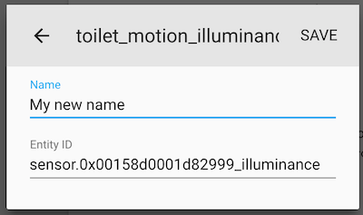
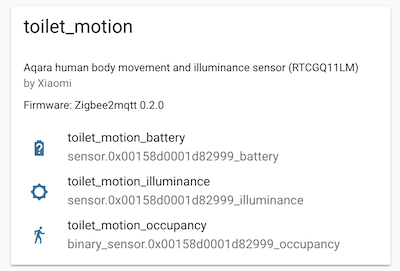

# Home Assistant

*NOTE 1: This file has been generated, do not edit this file manually!*

*NOTE 2: If you are using the [Zigbee2MQTT Hass.io add-on](https://github.com/zigbee2mqtt/hassio-zigbee2mqtt)
use their documentation*


## MQTT discovery
**NOTE:** Groups are not auto-discovered, see configuration below.

The easiest way to integrate Zigbee2MQTT with Home Assistant is by
using [MQTT discovery](https://www.home-assistant.io/docs/mqtt/discovery/).
This allows Zigbee2MQTT to automatically add devices to Home Assistant.

To achieve the best possible integration (including MQTT discovery):
- In your **Zigbee2MQTT** `configuration.yaml` set `homeassistant: true`
- In your **Home Assistant** `configuration.yaml`:


```yaml
mqtt:
  discovery: true
  broker: [YOUR MQTT BROKER]  # Remove if you want to use builtin-in MQTT broker
  # birth_message and will_message is not required anymore for Home Assistant 0.113 >=
  birth_message:
    topic: 'homeassistant/status'
    payload: 'online'
  will_message:
    topic: 'homeassistant/status'
    payload: 'offline'
```


Zigbee2MQTT is expecting Home Assistant to send it's birth/will
messages to `homeassistant/status`. If you are using a Home Assistant version newer than 0.113,
this is configured by default. If you are using an older version, be sure to add this to your `configuration.yaml`
if you want Zigbee2MQTT to resend the cached values when Home Assistant restarts

## Home Assistant device registry
When using Home Assistant MQTT discovery, Zigbee2MQTT integrates
with the [Home Assistant device registry](https://developers.home-assistant.io/docs/en/device_registry_index.html).
This allows you to change the Home Assistant `device_id` and `friendly_name` from the web interface
without having to restart Home Assistant. It also makes it possible to show which entities belong to which device.





## Customizing discovery
The device specific configuration allows you to modify the discovery payload. Here you can also prevent a device from being discovered. See [Device specific configuration](../../configuration/) for the available options.

## I'm confused about the different device IDs, names and friendly names
- Home Assistant `device_id`: determined on first discovery of the device, can only be changed
via the Home Assistant web interface afterwards. Used to control/read the state from the device (e.g. in automations)
- Zigbee2MQTT `friendly_name`: used to change the MQTT topic where the device listens and publishes to.
- Home Assistant `name`: name shown in the Home Assistant UI (unless overridden
via a `friendly_name` in `customize.yaml`). If not changed via the Home Assistant web interface,
it is equal to the Zigbee2MQTT `friendly_name`. Is updated if the Zigbee2MQTT `friendly_name` changes
(requires restart of Home Assistant)
- Home Assistant `friendly_name` (`customize.yaml`): overrides the name in the Home Assistant web interface.

## Responding to button clicks
To respond to button clicks (e.g. WXKG01LM) you can use one of the following three Home Assistant configurations.

### Via MQTT device trigger (recommended)
[MQTT device trigger](https://www.home-assistant.io/integrations/device_trigger.mqtt/) is the recommended way to respond to button clicks.
Note that it at least requires Home Assistant 0.106.0.

The MQTT device triggers are discovered by Zigbee2MQTT once the event is triggered on the device once.


```yaml
automation:
  - alias: Respond to button click
    trigger:
    - device_id: ad44cabee4c646f493814306aa6446e1
      discovery_id: 0x000b57fffecb472d action_arrow_left_click
      domain: mqtt
      platform: device
      subtype: arrow_left_click
      type: action
    action:
      entity_id: light.my_bulb_light
      service: light.toggle
```


If you only plan to use this and want to disable the *Via Home Assistant entity* integration below, set `homeassistant_legacy_triggers: false` (see [Configuration](../../configuration/) for more info).

### Via Home Assistant entity


```yaml
automation:
  - alias: Respond to button click
    trigger:
      platform: state
      entity_id: sensor.my_switch_click
      to: 'single'
    action:
      entity_id: light.my_bulb_light
      service: light.toggle
```


### Via MQTT
As an alternative to the above way of integrating, you can also listen to MQTT topics.


```yaml
automation:
  - alias: Respond to button clicks
    trigger:
      platform: mqtt
      topic: 'zigbee2mqtt/<FRIENDLY_NAME'
    condition:
      condition: template
      value_template: '{{ "single" == trigger.payload_json.click }}'
    action:
      entity_id: light.bedroom
      service: light.toggle
```


## Groups
Groups discovery is supported for groups of lights, switches, locks and covers. For other types you have to manually create a config in the Home Assistant `configuration.yaml`.

## Exposing switch as a light
If your device is currently discovered as a switch and you want to discover it as a light, the following config in the Zigbee2MQTT `configuration.yaml` can be used:


```yaml
devices:
  "0x12345678":
    friendly_name: my_switch
    homeassistant:
      switch:
        type: light
        object_id: light
      light:
        name: my_switch
        value_template: null
        state_value_template: '{{ value_json.state }}'
      # OR if your devices has multiple endpoints (e.g. left/right)
      switch_left:
        type: light
        object_id: light_left
      light_left:
        name: my_switch_left
        value_template: null
        state_value_template: '{{ value_json.state_left }}'
      switch_right:
        type: light
        object_id: light_right
      light_right:
        name: my_switch_right
        value_template: null
        state_value_template: '{{ value_json.state_right }}'
```


If you are also using device specific overrides, make sure that they are configured under the new device type rather than the original device type.

## Controlling Zigbee2MQTT via Home Assistant
The following Home Assistant configuration allows you to control Zigbee2MQTT from Home Assistant.

You can add it to the appropriate section of your `configuration.yaml`, or you can add it as a [Home Assistant Package](https://www.home-assistant.io/docs/configuration/packages/) by adding the following to `zigbee2mqtt.yaml` in your packages folder.


```yaml
# Input select for Zigbee2MQTT debug level
input_select:
  zigbee2mqtt_log_level:
    name: Zigbee2MQTT Log Level
    options:
      - debug
      - info
      - warn
      - error
    initial: info
    icon: mdi:format-list-bulleted

# Input number for joining time remaining (in minutes)
input_number:
  zigbee2mqtt_join_minutes:
    name: "Zigbee2MQTT join minutes"
    initial: 2
    min: 1
    max: 5
    step: 1
    mode: slider

# Input text to input Zigbee2MQTT friendly_name for scripts
input_text:
  zigbee2mqtt_old_name:
    name: Zigbee2MQTT Old Name
    initial: ""
  zigbee2mqtt_new_name:
    name: Zigbee2MQTT New Name
    initial: ""
  zigbee2mqtt_remove:
    name: Zigbee2MQTT Remove
    initial: ""

# Input boolean to set the force remove flag for devices
input_boolean:
  zigbee2mqtt_force_remove:
    name: Zigbee2MQTT Force Remove
    initial: false
    icon: mdi:alert-remove

# Scripts for renaming & removing devices
script:
  zigbee2mqtt_rename:
    alias: Zigbee2MQTT Rename
    sequence:
      service: mqtt.publish
      data_template:
        topic: zigbee2mqtt/bridge/request/device/rename
        payload_template: >-
          {
            "from": "{{ states.input_text.zigbee2mqtt_old_name.state | string }}",
            "to": "{{ states.input_text.zigbee2mqtt_new_name.state | string }}"
          }
  zigbee2mqtt_remove:
    alias: Zigbee2MQTT Remove
    sequence:
      service: mqtt.publish
      data_template:
        topic: zigbee2mqtt/bridge/request/device/remove
        payload_template: >-
          {
            "id": "{{ states.input_text.zigbee2mqtt_remove.state | string }}",
            "force": falsetrue
          }

# Timer for joining time remaining (120 sec = 2 min)
timer:
  zigbee_permit_join:
    name: Time remaining
    duration: 120

sensor:
  # Sensor for monitoring the bridge state
  - platform: mqtt
    name: Zigbee2MQTT Bridge state
    state_topic: "zigbee2mqtt/bridge/state"
    icon: mdi:router-wireless
  # Sensor for Showing the Zigbee2MQTT Version
  - platform: mqtt
    name: Zigbee2MQTT Version
    state_topic: "zigbee2mqtt/bridge/info"
    value_template: "{{ value_json.version }}"
    icon: mdi:zigbee
  # Sensor for Showing the Coordinator Version
  - platform: mqtt
    name: Coordinator Version
    state_topic: "zigbee2mqtt/bridge/info"
    value_template: "{{ value_json.coordinator }}"
    icon: mdi:chip

# Switch for enabling joining
switch:
  - platform: mqtt
    name: "Zigbee2MQTT Main join"
    state_topic: "zigbee2mqtt/bridge/info"
    value_template: '{{ value_json.permit_join | lower }}'
    command_topic: "zigbee2mqtt/bridge/request/permit_join"
    payload_on: "true"
    payload_off: "false"

automation:
  # Automation for sending MQTT message on input select change
  - alias: Zigbee2MQTT Log Level
    initial_state: "on"
    trigger:
      platform: state
      entity_id: input_select.zigbee2mqtt_log_level
    action:
      - service: mqtt.publish
        data:
          payload_template: "{{ states('input_select.zigbee2mqtt_log_level') }}"
          topic: zigbee2mqtt/bridge/request/config/log_level
  # Automation to start timer when enable join is turned on
  - id: zigbee_join_enabled
    alias: Zigbee Join Enabled
    trigger:
      platform: state
      entity_id: switch.zigbee2mqtt_main_join
      to: "on"
    action:
      service: timer.start
      entity_id: timer.zigbee_permit_join
      data_template:
        duration: "{{ '00:0%i:00' % (states('input_number.zigbee2mqtt_join_minutes') | int ) }}"
  # Automation to stop timer when switch turned off and turn off switch when timer finished
  - id: zigbee_join_disabled
    alias: Zigbee Join Disabled
    trigger:
      - platform: event
        event_type: timer.finished
        event_data:
          entity_id: timer.zigbee_permit_join
      - platform: state
        entity_id: switch.zigbee2mqtt_main_join
        to: "off"
    action:
      - service: timer.cancel
        data:
          entity_id: timer.zigbee_permit_join
      - service: switch.turn_off
        entity_id: switch.zigbee2mqtt_main_join
  - id: "zigbee2mqtt_create_notification_on_successful_interview"
    alias: Zigbee Device Joined Notification
    trigger:
      platform: mqtt
      topic: 'zigbee2mqtt/bridge/event'
    condition:
      condition: template
      value_template: '{{trigger.payload_json.type == "device_interview" and trigger.payload_json.data.status == "successful" and trigger.payload_json.data.supported}}'
    action:
      - service: persistent_notification.create
        data_template:
          title: Device joined the Zigbee2MQTT network
          message: "Name: {{trigger.payload_json.data.friendly_name}},
                    Vendor: {{trigger.payload_json.data.definition.vendor}},
                    Model: {{trigger.payload_json.data.definition.model}},
                    Description: {{trigger.payload_json.data.definition.description}}"

```


The following is an example lovelace card configuration.



```yaml
title: Zigbee2MQTT
type: entities
show_header_toggle: false
entities:
  - entity: sensor.zigbee2mqtt_bridge_state
  - entity: sensor.zigbee2mqtt_version
  - entity: sensor.coordinator_version
  - entity: input_select.zigbee2mqtt_log_level
  - type: divider
  - entity: switch.zigbee2mqtt_main_join
  - entity: input_number.zigbee2mqtt_join_minutes
  - entity: timer.zigbee_permit_join
  - type: divider
  - entity: input_text.zigbee2mqtt_old_name
  - entity: input_text.zigbee2mqtt_new_name
  - entity: script.zigbee2mqtt_rename
  - type: divider
  - entity: input_text.zigbee2mqtt_remove
  - entity: input_boolean.zigbee2mqtt_force_remove
  - entity: script.zigbee2mqtt_remove
```



## Zigbee Network Map (Custom Card)
[Zigbee Network Map Home Assistant Custom Card](https://github.com/azuwis/zigbee2mqtt-networkmap/).

## Zigbee Network Map (Custom Component)
[Zigbee Network Map Home Assistant addon](https://github.com/rgruebel/ha_zigbee2mqtt_networkmap).

**NOTE:** This addon is not password protected (if you have provided external access to your Home Assistant instance **EVERYONE** can access your Network Map).
