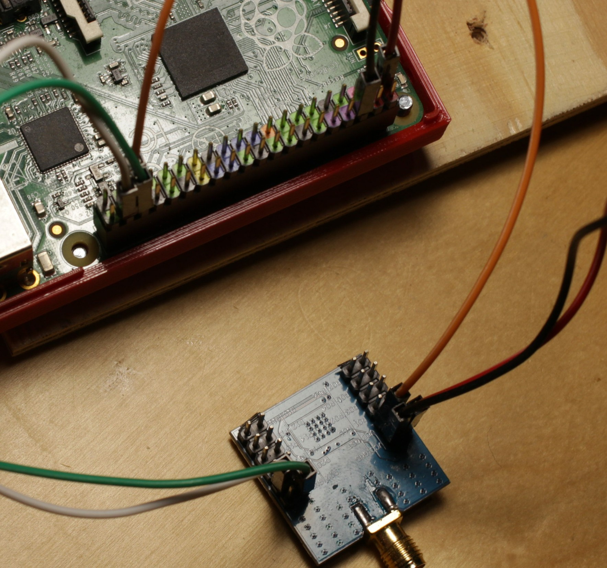

# How to flash and connect the CC2530 without a CC Cable or a USB adapter
The CC2530 is the least expensive zigbee adapter considered that it can be flashed and used without any "make dependencies" (tools we need to setup and then never again). This guide will show how to flash and use it with nothing but the CC2530 itself, the Raspberry Pi zigbee2mqtt will run on and five female-female Dupont cables.

## What pins to use
The CC2530 is usually flashed using a CC debugger or at least a downloader cable. Fortunately, the CC debugger does nothing a CLI tool can't do and the pins on the CC2530 are all suitable for standard Dupont cables. So, using the tables from [the guide for using the CC2530 as a router](how_to_create_a_cc2530_router.md) and [the alternative flashing methods guide](../information/alternative_flashing_methods.md), we figure out we need the following pins:

| CC debugger cable pin number | CC2530 pin name | RPi GPIO number (BCM) | RPi physical pin number |
| ----------- | ------ | ------ |------ |
| 1 | GND | - | any GND |
| 2 | VCC | - | any 3V3 |
| 3 | P22 | 16 | 36 |
| 4 | P21 | 20 | 38 |
| 7 | RST | 19 | 35 |

The second VCC pin is not necessary. Note that you do not need the debugger cable pin numbers if you do not use a debugger cable. Just connect the pins of the CC2530 directly with the Pi using Dupont cables.

See also [the Raspberry Pi GPIO documentation](https://www.raspberrypi.org/documentation/computers/os.html#gpio-and-the-40-pin-header).



## Flashing

The antenna does not need to be connected at this point.

These instructions are mostly the same as in [the alternative flashing methods guide](../information/alternative_flashing_methods.md) but for the CC2530.

1. Connect the pins as described above.
2. Install [wiringPi](http://wiringpi.com/download-and-install/), if not already installed.
3. Install the [flash_cc2531 tool](https://github.com/jmichault/flash_cc2531), it works fine vor the CC2530:
```bash
git clone https://github.com/jmichault/flash_cc2531.git
```
4. Get the firmware for the CC2530, see the [links in the adapter overview](../information/supported_adapters.md). Unzip it to the directory of the git repo you cloned above.
5. Test your connection by running :

```bash
cd flash_cc2531
./cc_chipid
```
it should return something like:
```
  ID = a524.
```
If you see 0000 or ffff, something is wrong and you should probably check your wiring.

6. Erase and flash the CC2531 :

```bash
./cc_erase
./cc_write CC2531ZNP-Prod.hex
```
It takes around 3 minutes.

## Connecting for usage

Shutdown your Pi and disconnect the CC2530. You can now continue in [the general guide for connecting the CC2530](../information/connecting_cc2530.md#to-a-raspberry-pi-zero).
