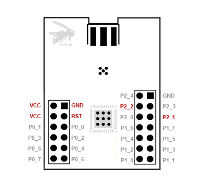
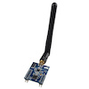

---
---
# Connecting the CC2530

## Pin layouts
The pin layout is different between each CC2530 module

| Name | Pin layout | Picture |
| ------------- | ------------- | ------------- |
| CC2530 |  | 
| Webee CC2530 + CC2591 |  | 

## Using a USB to serial adapter

### Confirmed working
This how-to has been confirmed working with the following CC2530 based devices:

| Device| Image |
| --- | --- |
| **CC2530** |  |

and the following USB to serial adapters:

| Device| Image |
| --- | --- |
| **CP2102** |  |

##### Flashing the firmware
The required coordinator fimrware can be found here: [Zigbee 1.2](https://github.com/Koenkk/Z-Stack-firmware/tree/master/coordinator/Z-Stack_Home_1.2/bin) and [Zigbee 3.0](https://github.com/Koenkk/Z-Stack-firmware/tree/master/coordinator/Z-Stack_3.0.x/bin).

### Connecting
Connect to CC2530 to the USB to serial adapter using the following mapping:

| USB-Serial Adaper  | CC2530  |
| :------------: |:---------------:|
| 3V3 | VCC |
| GND | GND |
| TXD | P02 |
| RXD | P03 |

Now plug in the USB-to-serial adapter in your USB port.

### Configuration
Add the following to your Zigbee2mqtt `configuration.yaml`:

```yaml
advanced:
  rtscts: false
```

and start Zigbee2mqtt, enjoy!

## To a Raspberry Pi (Zero)
CC2530 can be connected to a Raspberry PI (Zero) via GPIO Pins - no USB2FTDI is needed.

The use of UART by the installed Linux has to be disabled: [Detailed explanation here](https://www.raspberrypi.org/documentation/configuration/uart.md)

Enable UART in the Kernel and disable UART use for BlueTooth.

In `/boot/config.txt` add following lines:

```
enable_uart=1
dtoverlay=pi3-disable-bt
```

Disable the modem system service (on the command line):

```
sudo systemctl disable hciuart
```

Remove the console entry by removing any of those entries from `/boot/cmdline.txt` if present:

```
console=serial0,115200 console=ttyAMA0,115200

```

Reboot your Raspberry.

### Wiring CC2530 to the Raspberry

```
CC C2530 -> Raspberry
VCC -> 3,3V (Pin1)
GND -> GND (Pin6)
P02 -> TXD (Pin8 / BCM 14)
P03 -> RXD (Pin10 / BCM 15)
```


### Configuring zigbee2mqtt

Change the Serial Port in your `data/configuration.yaml` file:

```
serial:
  port: /dev/ttyAMA0
advanced:
  baudrate: 115200
  rtscts: false
```

Have fun.

## Via an ESP8266
This setup allows you to connect a CC2530 to an ESP8266 which can be put everywhere in your house. Via a serial socket, Zigbee2mqtt will connect to your CC2530.

### Wiring
Wire the CC2530 to the ESP8266 using the following scheme:

| ESP8266 | CC2530 |
| :------------: |:---------------:|
| 3v3     | VCC |
| GND     | GND |
| TX      | P02 |
| RX      | P03 |
| GND     | P20 |
| GND     | P04 |
| GND     | P05 |

### Flashing the ESP8266
The ESP8266 needs to be flashed with ESPEasy. ESPEasy has suficient documentation on how to get you up and running:
- [How to flash the ESP8266 with ESPEasy](https://www.letscontrolit.com/wiki/index.php?title=Tutorial_ESPEasy_Firmware_Upload)
- ESP8266 firmware: [ESP_Easy_mega-XXXXXXXX_normal_ESP8266_4096.bin](https://github.com/letscontrolit/ESPEasy/releases)
- [More information about ESPEasy](https://www.letscontrolit.com/wiki/index.php/ESPEasy#Introduction)

### Setting up the ESP8266
Open the ESPEasy web interface and complete the setup. Afterwards open the web interface again.

Click on *Devices* Edit of the first task and select *Communication - Serial Server* from the dropdown list.

Fill in the form as following:
```
a.    Name: ZIGBEE2MQTT
b.    Enabled: checked
c.    TCP Port: a number between 1000 and 9999 "1775"
d.    Baud Rate: 115200
e.    Data bits: 8
f.    Parity: No Parity
g.    Stop bits: 1
h.    Reset target after boot: - none –
i.    RX receive timeout: 0
j.    Event processing: Generic
```

Press Submit, the setup is now completed.

### Zigbee2mqtt configuration
Now add the following to the Zigbee2mqtt `configuration.yaml`:

```yaml
serial:
    port: 'tcp://192.168.2.13:20108'
```

Note to change the IP address and port.
You can now start Zigbee2qmtt.
