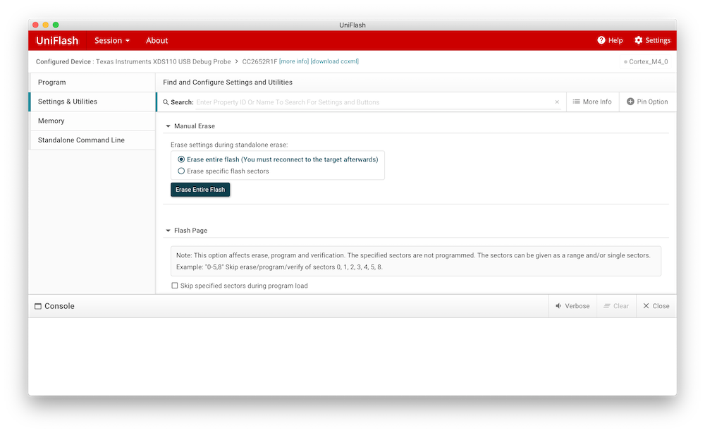
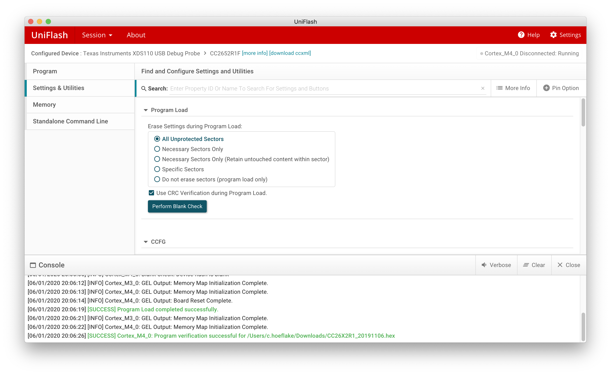

# Flashing via UNIFLASH

UNIFLASH can be used to flash certain Texas Instruments MCUs (e.g. CC26X2R1 and CC1352P-2). It runs on Windows, macOS and Linux.

1. Download and install UNIFLASH: [download link](http://www.ti.com/tool/download/UNIFLASH)
2. Plug your device
3. Start UNIFLASH, your device will automatically be detected, press *Start*

4. Go to *Settings & Utilities* -> *Manual Erase* and press *Erase Entire Flash*

5. Go to *Settings & Utilities* -> *Program Load* and select *All Unprotected Sectors*
   eventually click *Perform Blank Check* (not required)

6. Go to *Program* -> *Flash Image(s)*, press *Browse* to select the firmware.
7. Now click *Load image* to upload the firmware

8. Done!
